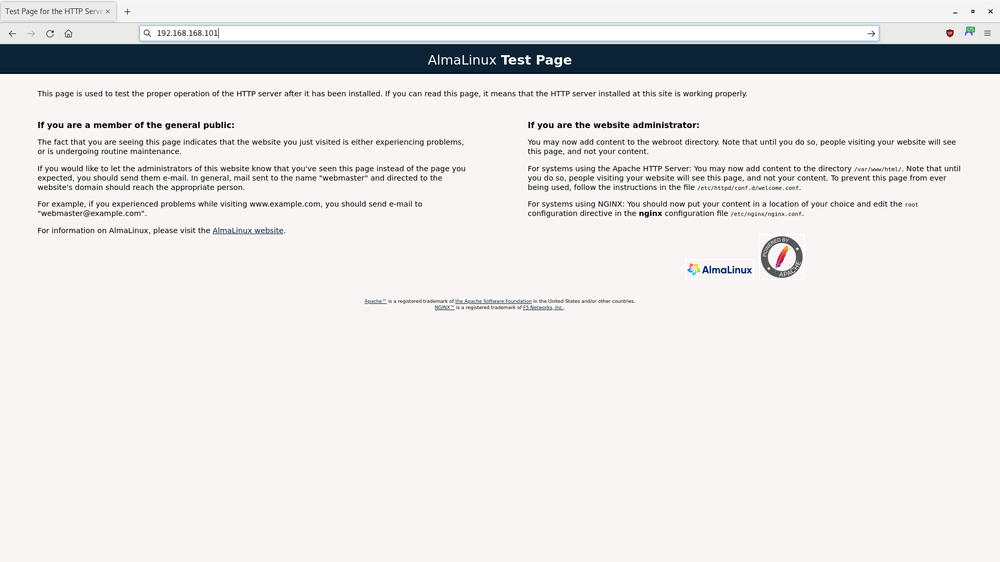
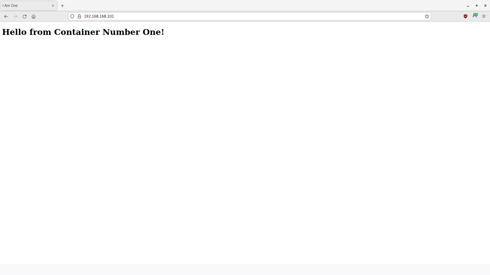

# Podman Network Demo

In this tutorial, you will create a simple network of containers. Each container will run two services: HTTP, to deliver web content to clients; and SSH, to allow remote access for administrators using tools such as Ansible, PuTTY, etc.

- [Environment](#environment)
- [Start Podman](#start-podman)
- [Create the Network](#create-the-network)
- [Create and Add the Containers to the Network](#create-and-add-the-containers-to-the-network)
- [Test the Network](#test-the-network)
- [Access the Containers through SSH](#access-the-containers-through-ssh)
- [Access the Containers using HTTP](#access-the-containers-using-http)
- [Stop and Start the Containers](#stop-and-start-the-containers)
- [Summary](#summary)

> **WARNING** - This is only a proof-of-concept demo for a single user! Do not use for production.

-----

## Environment

- A development host, running a Fedora distribution later than 28 (e.g., Red Hat Linux 8, etc.), with a web browser (e.g., Mozilla Firefox); the latest version of Podman compatible with your system; and Python 3.9 or later.
- If you are using Red Hat, you will need a subscription to Red Hat to update your system and access packages. Red Hat offers a free [Red Hat Developer Subscription for Individuals](https://developers.redhat.com/).
- The OpenSSH client, if it is not already installed. To install OpenSSH client, open a Terminal and enter the following command: `sudo yum -y install openssh openssh-askpass openssh-clients`.
- You will also need the sshpass utility and the Ansible automation suite. To install them, open a Terminal and enter the following command: `python3 -m pip install sshpass ansible`.

Podman supports ["rootful" (system) and "rootless" (user) modes](https://developers.redhat.com/blog/2020/09/25/rootless-containers-with-podman-the-basics), but, for this demo, you will use "rootful" containers to allow the development host to communicate with its containers using Secure Shell (SSH).

-----

## Start Podman

1. Open a Terminal and start the Podman service:

    ```bash
    sudo systemctl start podman
    ```

   > **NOTE** - Enable the podman service if you want it to automatically start when your host boots
   up:
   >
   > ```bash
   > sudo systemctl enable podman
   > ```

-----

## Create the Network

1. Open a Terminal, if one is not already open.

2. Create a container network named `devnet`:

    ```bash
    # Optional; remove the network if it already exists
    sudo podman network rm --force devnet
    # Create the container network
    sudo podman network create --driver bridge --subnet 192.168.168.0/24 --gateway 192.168.168.1 devnet
    ```

3. Check your work:

    ```bash
    sudo podman network ls | grep devnet && sudo podman inspect devnet
    ```

   **Output:**

    ```bash
    db9c2f3d9431  devnet      bridge
    [
         {
              "name": "devnet",
              "id": "db9c2f3d943127dd1659b276ffc3b3a8f082f04f850acfbb008f4984cc0012f2",
              "driver": "bridge",
              "network_interface": "cni-podman1",
              "created": "2023-07-01T13:26:00.733731157-04:00",
              "subnets": [
                   {
                        "subnet": "192.168.168.0/24",
                        "gateway": "192.168.168.1"
                   }
              ],
              "ipv6_enabled": false,
              "internal": false,
              "dns_enabled": false,
              "ipam_options": {
                   "driver": "host-local"
              }
         }
    ]
    ```

-----

## Create and Add the Containers to the Network

For this tutorial, you will use the freely available AlmaLinux 8 image as the operating system for your containers. However, you may use other comparable images, such as CentOS, Rocky Linux, or a Red Hat's Universal Base Image (UBI) (subscription required).

1. Open a Terminal, if one is not already open.

2. Create a containerfile:

    ```bash
    touch managed_node.containerfile
    ```

3. Using an editor of your choice, open `managed_node.containerfile` and add the following code:

    ```text
    # Pull a Docker or Podman image. For this demo, you will use AlmaLinux 8
    FROM almalinux:8

    # Ensure system is up-to-date
    RUN yum -y update &&\
        yum -y upgrade &&\
        yum -y clean all &&\
        yum -y autoremove

    # Ensure the passwd utility is installed
    RUN yum -y install passwd

    # Create a non-root user and create a root password
    # useradd  --comment "Default User Account" --create-home -groups wheel user
    RUN useradd -c "Default User Account" -m -G wheel user &&\
        echo Change.Me.123 | passwd user --stdin &&\
        echo Change.Me.321 | passwd root --stdin

    # Adapted from https://access.redhat.com/solutions/7015042
    # Install openssh, httpd, and sudo
    RUN yum -y install openssh openssh-askpass openssh-clients openssh-server &&\
        yum -y install httpd &&\
        yum -y install sudo

    # Enable the HTTP and SSH daemons
    RUN systemctl enable httpd &&\
        systemctl enable sshd

    # Customize the SSH daemon
    RUN mkdir --parents /var/run/sshd &&\
        ssh-keygen -A &&\
        cp /etc/ssh/sshd_config /etc/ssh/sshd_config.bak &&\
        sed -i 's/PermitRootLogin prohibit-password/PermitRootLogin yes/' /etc/ssh/sshd_config &&\
        cp /etc/pam.d/sshd /etc/pam.d/sshd.bak &&\
        sed -i 's@session\s*required\s*pam_loginuid.so@#session optional pam_loginuid.so@g' /etc/pam.d/sshd

    # Prevent 'System is booting up. Unprivileged users are not permitted to log in yet' error when not root
    # Do not exit on error if the directory does not exist: rm /run/nologin || true
    RUN rm /run/nologin || :

    # Pass environment variables 
    # https://stackoverflow.com/questions/36292317/why-set-visible-now-in-etc-profile
    ENV NOTVISIBLE "in users profile"
    RUN echo "export VISIBLE=now" >> /etc/profile

    # Allow traffic through ports 22 (SSH) and 80 (HTTP)
    EXPOSE 22 80

    # Start the systemd service
    # https://access.redhat.com/documentation/en-us/red_hat_enterprise_linux_atomic_host/7/html/managing_containers/running_containers_as_systemd_services_with_podman#starting_services_within_a_container_using_systemd
    CMD [ "/sbin/init" ]
    ```

4. Build the image:

   > **NOTE** - Podman uses `/var/tmp` by default to download and build images. If a `No space left on device` error appears during the build, you can change the `image_copy_tmp_dir` setting in the `containers.conf` file, usually located in `/usr/share/containers/containers.conf`.

    ```bash
    # Optional; remove final and intermediate images if they exist
    sudo podman rmi managed_node_image --force
    sudo podman image prune --all --force
    # Build the image
    sudo podman build --rm --tag=managed_node_image --file=managed_node.containerfile
    ```

5. Once complete, look at your image's information:

    ```bash
    sudo podman images
    ```

   **Output (other images may also appear):**

    ```bash
    REPOSITORY                    TAG         IMAGE ID      CREATED             SIZE
    localhost/managed_node_image  latest      b56dd8d6ac97  About a minute ago  408 MB
    docker.io/library/almalinux   8           4e97feadb276  6 weeks ago         204 MB
    ...
    ```

   > **NOTE** - Any repositories named `<none>` that appear are intermediate images, used to build the final image. However, the `--rm` option should have told Podman to delete them after a successful build.

6. Using the new image, create two managed nodes and attach them to the network:

    ```bash
    # Optional; stop and remove the nodes if they exist
    sudo podman stop managed_node1
    sudo podman rm managed_node1
    sudo podman stop managed_node2
    sudo podman rm managed_node2
    # Create the nodes and attach them to the network
    sudo podman run --detach --tty --name=managed_node1 --replace --restart=unless-stopped --network=devnet --ip=192.168.168.101 --cap-add AUDIT_WRITE managed_node_image
    sudo podman run -dt --name managed_node2 --replace --restart=unless-stopped --net devnet --ip 192.168.168.102 --cap-add AUDIT_WRITE managed_node_image
    ```

7. Look at the containers:

    ```bash
    sudo podman ps --all
    ```

   **Output (other nodes may also appear):**

    ```bash
    CONTAINER ID  IMAGE                                COMMAND     CREATED            STATUS                     PORTS       NAMES
    52d0c44c6b0b  localhost/managed_node_image:latest  /sbin/init  5 minutes ago  Up 5 minutes                               managed_node1
    46781391b155  localhost/managed_node_image:latest  /sbin/init  5 minutes ago  Up 5 minutes                               managed_node2
    ...
    ```

8. Check the IPv4 addresses of the nodes; they should be `192.168.168.101` and `192.168.168.102`,
   respectively:

    ```bash
    sudo podman inspect managed_node1 -f '{{ .NetworkSettings.Networks.devnet.IPAddress }}'
    sudo podman inspect managed_node2 -f '{{ .NetworkSettings.Networks.devnet.IPAddress }}'
    ```

-----

## Test the Network

1. Open a Terminal, if one is not already open.

2. Ping the nodes from the development host; if you are unable to establish connectivity, repeat the steps in [Create and Add the Containers to the Network](#create-and-add-the-containers-to-the-network):

    ```bash
    ping -c 2 192.168.168.101
    ping -c 2 192.168.168.102
    ```

3. Access the first container (managed_node1), using Podman:

   > **NOTE** - Since you are running a process in the container, and not a shell, you cannot use `sudo podman attach managed_node1`.

    ```bash
    sudo podman exec -it managed_node1 /usr/bin/bash
    ```

   **Output:**

    ```bash
    [root@f55ec8748738 /]#
    ```

4. Ping the second container (managed_node2) from managed_node1:

    ```bash
    ping -c 2 192.168.168.102
    ```

   **Output:**

    ```bash
    PING 192.168.168.102 (192.168.168.102) 56(84) bytes of data.
    64 bytes from 192.168.168.102: icmp_seq=1 ttl=64 time=0.047 ms
    64 bytes from 192.168.168.102: icmp_seq=2 ttl=64 time=0.067 ms

    --- 192.168.168.102 ping statistics ---
    2 packets transmitted, 2 received, 0% packet loss, time 1021ms
    rtt min/avg/max/mdev = 0.047/0.057/0.067/0.010 ms
    ```

5. Log out when finished:

    ```bash
    exit
    ```

   > **NOTE** - When you exit the shell, the container may stop. However, since you used the `--restart unless-stopped` (or `--restart always`) option when you created the container, if this occurs, the container will automatically restart upon exit, creating a new shell.

6. Perform the same tasks on the second container (managed_node2).

-----

## Access the Containers through SSH

> **NOTE** -
>
> - Ensure you have installed the OpenSSH client on the development host: `sudo yum -y install openssh openssh-askpass openssh-clients`
> - Ensure you have installed the sshpass utility on the development host: `python3 -m pip install sshpass`

1. Open a Terminal, if one is not already open.

2. Access the first container (`192.168.168.101`), using SSH as `root`; enter `Change.Me.321` when prompted for a password:

    ```bash
    ssh -o StrictHostKeyChecking=no -o UserKnownHostsFile=/dev/null root@192.168.168.101
    ```

   **Output:**

    ```bash
    Warning: Permanently added '192.168.168.101' (ECDSA) to the list of known hosts.
    root@192.168.168.101's password: 
    [root@15316195c9f0 ~]# 
    ```

    > **NOTE** - If you receive the following warning:
    >
    > ```bash
    > @@@@@@@@@@@@@@@@@@@@@@@@@@@@@@@@@@@@@@@@@@@@@@@@@@@@@@@@@@@
    > @    WARNING: REMOTE HOST IDENTIFICATION HAS CHANGED!     @
    > @@@@@@@@@@@@@@@@@@@@@@@@@@@@@@@@@@@@@@@@@@@@@@@@@@@@@@@@@@@
    > IT IS POSSIBLE THAT SOMEONE IS DOING SOMETHING NASTY!
    > ```
    >
    > ...run the following command to remove the container's IPv4 address from your `~/.ssh/known_hosts` file:
    >
    > ```bash
    > ssh-keygen -R 192.168.168.101
    > ```

3. Ping the second container (managed_node2) from managed_node1:

    ```bash
    ping -c 2 192.168.168.102
    ```

   **Output:**

    ```bash
    PING 192.168.168.102 (192.168.168.102) 56(84) bytes of data.
    64 bytes from 192.168.168.102: icmp_seq=1 ttl=64 time=0.047 ms
    64 bytes from 192.168.168.102: icmp_seq=2 ttl=64 time=0.067 ms

    --- 192.168.168.102 ping statistics ---
    2 packets transmitted, 2 received, 0% packet loss, time 1021ms
    rtt min/avg/max/mdev = 0.047/0.057/0.067/0.010 ms
    ```

4. Log out when finished:

    ```bash
    logout
    ```

5. Access the first container (`192.168.168.101`), using SSH as `user`; enter `Change.Me.123` when prompted for a password:

    ```bash
    ssh -o StrictHostKeyChecking=no -o UserKnownHostsFile=/dev/null user@192.168.168.101
    ```

   **Output:**

    ```bash
    Warning: Permanently added '192.168.168.101' (ECDSA) to the list of known hosts.
    user@192.168.168.101's password: 
    [user@15316195c9f0 ~]$ 
    ```

6. Ping the second container (managed_node2) from managed_node1; enter `Change.Me.123` when prompted for a password:

    ```bash
    sudo ping -c 2 192.168.168.102
    ```

   **Output:**

    ```bash
    PING 192.168.168.102 (192.168.168.102) 56(84) bytes of data.
    64 bytes from 192.168.168.102: icmp_seq=1 ttl=64 time=0.047 ms
    64 bytes from 192.168.168.102: icmp_seq=2 ttl=64 time=0.067 ms

    --- 192.168.168.102 ping statistics ---
    2 packets transmitted, 2 received, 0% packet loss, time 1021ms
    rtt min/avg/max/mdev = 0.047/0.057/0.067/0.010 ms
    ```

7. Log out when finished:

    ```bash
    logout
    ```

8. Perform the same tasks on the second container (managed_node2).

-----

## Access the Containers using HTTP

1. Open a Terminal, if one is not already open.

2. Open a browser and navigate to the IPv4 address of the first node:

    ```bash
    firefox 192.168.168.101:80
    ```

3. The Apache HTTP Server Test Page should appear:

   

4. If you open a browser and navigate to the IPv4 address of the second node, the Apache HTTP Server Test Page should also appear:

    ```bash
    firefox 192.168.168.102:80
    ```

5. Create a webpage:

    ```bash
    touch one.html
    ```

6. Using an editor of your choice, add the following code to `one.html`:

    ```html
    <!DOCTYPE HTML>
    <html lang="en">
    <head>
        <META charset="UTF-8">
        <META name="viewport"
              content="width=device-width, initial-scale=1.0">
        <title>I Am One</title>
    </head>
    <body>
    <h1>Hello from Container Number One!</h1>
    </body>
    </html>
    ```

7. Copy the web page to the Apache document root path; enter `Change.Me.321` when prompted for a password:

    ```bash
    scp -o StrictHostKeyChecking=no -o UserKnownHostsFile=/dev/null one.html root@192.168.168.101:/var/www/html/index.html
    ```

8. If your browser is still open at `192.168.168.101:80`, refresh the page. If not, reopen a browser and navigate to the IPv4 address of the first node:

    ```bash
    firefox 192.168.168.101:80
    ```

9. Your web page should appear.

   

10. Repeat Steps 5 through 9, but use the IPv4 address of the second container (`192.168.168.102`) and replace "one" with "two" in the title and text of the `one.html` file.

-----

## Stop and Start the Containers

1. Open a Terminal, if one is not already open.

2. To stop a container without deleting it:

    ```bash
    sudo podman stop managed_node1
    ```

3. To restart the container:

    ```bash
    sudo podman start managed_node1
    ```

-----

## Summary

In this tutorial, you have created a simple network of containers, with each container running an HTTP and SSH service. Please continue to the [Subversion Container Demo](/02-svn-container/02-svn-container.md). Remember, this is only a proof-of-concept demo for a single user; you should not use it for production.
