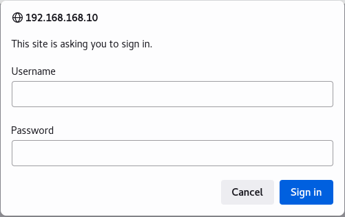
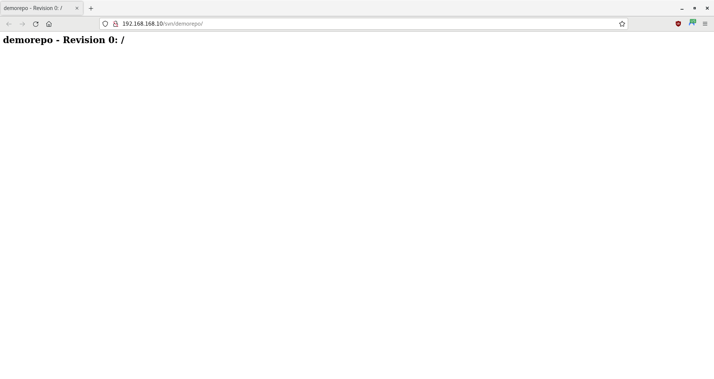
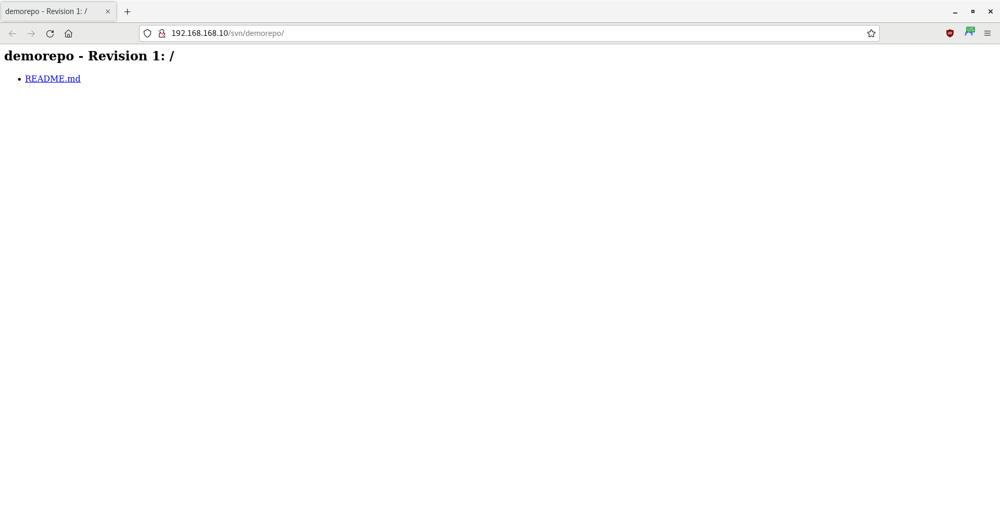

# Subversion Container Demo

In this tutorial, you will run Apache Subversion, known as SVN, in a container, to act as a software versioning and revision control server.

- [Getting Started](#getting-started)
- [Create and Add the Subversion Server Container to the Network](#create-and-add-the-subversion-server-container-to-the-network)
- [Access Subversion](#access-subversion)
- [Checkout the Repository](#checkout-the-repository)
- [Commit to the Repository](#commit-to-the-repository)
- [Summary](#summary)

> **WARNING** -  This is only a proof-of-concept demo for a single user! Do not use for production.

-----

## Getting Started

Perform the following tasks from the [Podman Network Demo](/01-podman-network/01-podman-network.md).

- [Environment](/01-podman-network/01-podman-network.md#environment)
- [Start Podman](/01-podman-network/01-podman-network.md#start-podman)
- [Create the Network](/01-podman-network/01-podman-network.md#create-the-network)

You will also need Subversion on the development host. To install it, open a Terminal and enter the following command: `sudo yum -y install subversion`.

-----

## Create and Add the Subversion Server Container to the Network

For this tutorial, you will use the freely available AlmaLinux 8 image as the operating system for your containers. However, you may use other comparable images, such as CentOS, Rocky Linux, or a Red Hat's Universal Base Image (UBI) (subscription required).

1. Open a Terminal, if one is not already open.

2. Create a Subversion configuration file:

    ```
    touch subversion.conf
    ```

3. Using an editor of your choice, open `subversion.conf` and add the following text:

    ```
    <Location /svn>
        DAV svn
        SVNParentPath /var/www/svn/
        AuthType Basic
        AuthName "SVN Repository"
        AuthUserFile /etc/svn/svn-auth-users
        Require valid-user
    </Location>
    ```

4. Create a containerfile:

    ```
    touch svn.containerfile
    ```

5. Using an editor of your choice, open `svn.containerfile` and add the following code:

    ```
    # Pull a Docker or Podman image. For this demo, you will use AlmaLinux 8
    FROM almalinux:8

    # Ensure system is up-to-date
    RUN yum -y update &&\
        yum -y upgrade &&\
        yum -y clean all &&\
        yum -y autoremove

    # Ensure the passwd utility is installed
    RUN yum -y install passwd

    # Create a non-root user and create a root password
    # useradd  --comment "Default User Account" --create-home -groups wheel user
    RUN useradd -c "Default User Account" -m -G wheel user &&\
        echo Change.Me.123 | passwd user --stdin &&\
        echo Change.Me.321 | passwd root --stdin

    # Adapted from https://access.redhat.com/solutions/7015042
    # Install openssh, httpd, and sudo
    RUN yum -y install openssh openssh-askpass openssh-clients openssh-server &&\
        yum -y install httpd &&\
        yum -y install sudo

    # Enable the HTTP and SSH daemons
    RUN systemctl enable httpd &&\
        systemctl enable sshd

    # Customize the SSH daemon
    RUN mkdir /var/run/sshd &&\
        ssh-keygen -A &&\
        cp /etc/ssh/sshd_config /etc/ssh/sshd_config.bak &&\
        sed -i 's/PermitRootLogin prohibit-password/PermitRootLogin yes/' /etc/ssh/sshd_config &&\
        cp /etc/pam.d/sshd /etc/pam.d/sshd.bak &&\
        sed 's@session\s*required\s*pam_loginuid.so@#session optional pam_loginuid.so@g' -i /etc/pam.d/sshd

    # Prevent 'System is booting up. Unprivileged users are not permitted to log in yet' error when not root
    # Do not exit on error if the directory does not exist: rm /run/nologin || true
    RUN rm /run/nologin || :

    # Pass environment variables 
    # https://stackoverflow.com/questions/36292317/why-set-visible-now-in-etc-profile
    ENV NOTVISIBLE "in users profile"
    RUN echo "export VISIBLE=now" >> /etc/profile

    # Ensure Subversion is installed
    RUN yum install -y subversion mod_dav_svn

    # TODO: Name-based Virtual Host Support
    RUN sed -i -E 's/^.?ServerName.*/ServerName svn.rgcoding.dev/g' /etc/httpd/conf/httpd.conf

    # Add an Apache Subversion configuration file
    ADD subversion.conf /etc/httpd/conf.d/subversion.conf

    # Create a user in batch mode and set file permissions
    RUN mkdir --parents /etc/svn &&\
        htpasswd -b -c /etc/svn/svn-auth-users svnuser Change.Me.123 &&\
        chown root:apache /etc/svn/svn-auth-users &&\
        chmod 640 /etc/svn/svn-auth-users

    # Create a repository
    RUN export LC_ALL=C &&\
        mkdir --parents /var/www/svn &&\
        cd /var/www/svn/ &&\
        svnadmin create demorepo

    # To prevent the following issues:
    # svn: E000013: Can't open file '/var/www/svn/demorepo/db/txn-current-lock': Permission denied
    # Warning: post commit FS processing had error: sqlite[S8]: attempt to write a readonly database
    RUN chown -R apache:apache /var/www/svn/demorepo/
    RUN chmod -R 764 /var/www/svn/demorepo/

    # # Apply SELinux rules if enabled
    RUN #!/bin/bash\
        selinuxenabled\
        if [ $? -ne 0 ]; then\
            chcon -R -t httpd_sys_content_t /var/www/svn/demorepo/\
            chcon -R -t httpd_sys_rw_content_t /var/www/svn/demorepo\
        fi

    # Allow traffic through ports 22 (SSH), 80 (HTTP), and SVN (3690)
    EXPOSE 22 80 3690

    # Start the systemd service
    # https://access.redhat.com/documentation/en-us/red_hat_enterprise_linux_atomic_host/7/html/managing_containers/running_containers_as_systemd_services_with_podman#starting_services_within_a_container_using_systemd
    CMD [ "/sbin/init" ]
    ```

6. Build the image:

    > **NOTE** - Podman uses `/var/tmp` by default to download and build images. If a `No space left on device` error appears during the build, you can change the `image_copy_tmp_dir` setting in the `containers.conf` file, usually located in `/usr/share/containers/containers.conf`.

    ```
    # Optional; remove final and intermediate images if they exist
    sudo podman rmi svn_node_image --force
    sudo podman image prune --all --force
    # Build the image
    sudo podman build --rm --tag=svn_node_image --file=svn.containerfile
    ```

7. Once complete, look at your image's information:

    ```
    sudo podman images
    ```

    **Output (other images may also appear):**

    ```
    REPOSITORY                    TAG         IMAGE ID      CREATED             SIZE
    localhost/svn_node_image      latest      ba37891ab764  About a minute ago  434 MB
    docker.io/library/almalinux   8           4e97feadb276  6 weeks ago         204 MB
    ...
    ```

    > **NOTE** - Any repositories named `<none>` that appear are intermediate images, used to build the final image. However, the `--rm` option should have told Podman to delete them after a successful build.

8. Using the new image, create an SVN node and attach it to the network:

    ```
    # Optional; stop and remove the node if it exists
    sudo podman stop svn_node
    sudo podman rm svn_node
    # Create the node and attach it to the network
    sudo podman run -dt --name svn_node --replace --restart=unless-stopped --net devnet --ip 192.168.168.10 --cap-add AUDIT_WRITE svn_node_image
    ```

9. Look at the containers:

    ```
    sudo podman ps --all
    ```

    **Output (other nodes may also appear):**

    ```
    CONTAINER ID  IMAGE                                COMMAND     CREATED             STATUS              PORTS       NAMES
    a60d468d104c  localhost/svn_node_image:latest      /sbin/init  About a minute ago  Up About a minute               svn_node
    ...
    ```

10. Check the IPv4 addresses of the node; it should be `192.168.168.10`:

    ```
    sudo podman inspect svn_node -f '{{ .NetworkSettings.Networks.devnet.IPAddress }}'
    ```

-----

## Access Subversion

1. Open a Terminal, if one is not already open.

2. Open a browser and navigate to the IPv4 address of the repository:

    ```
    firefox 192.168.168.10/svn/demorepo
    ```

3. A popup window should appear, asking you to log in:

    

4. Enter `svnuser` for the username and `Change.Me.123` for the password, then click on **Sign In**.

5. The `demorepo` landing page should appear:

    

-----

## Checkout the Repository

> **NOTE** - Ensure you have installed Subversion on the development host: `sudo yum -y install subversion`

1. Open a Terminal, if one is not already open.

2. Checkout the repository:

    ```
    svn checkout http://192.168.168.10/svn/demorepo/
    ```

3. If prompted for your sudo credentials, enter your password:

    ```
    Authentication realm: <http://192.168.168.10:80> SVN Repository
    Password for '<your username>': *************
    ```

4. When prompted for the repository credentials, enter `svnuser` for the username and `Change.Me.123` for the password:

    ```
    Authentication realm: <http://192.168.168.10:80> SVN Repository
    Username: svnuser
    Password for 'svnuser': *************
    ```

5. When asked if you would like to store your password unencrypted, enter `no`:

    ```
    -----------------------------------------------------------------------
    ATTENTION!  Your password for authentication realm:

    <http://192.168.168.10:80> SVN Repository

    can only be stored to disk unencrypted!  You are advised to configure
    your system so that Subversion can store passwords encrypted, if
    possible.  See the documentation for details.

    You can avoid future appearances of this warning by setting the value
    of the 'store-plaintext-passwords' option to either 'yes' or 'no' in
    '/home/<your username>/.subversion/servers'.
    -----------------------------------------------------------------------
    Store password unencrypted (yes/no)? no
    Checked out revision 0.
    ```

6. Using an editor of your choice, open your local `.subversion/servers` (e.g., `~/.subversion/servers` or `/home/<your username>/.subversion/servers`) and, in the **`[global]`** section near the bottom of the file, uncomment and set the value of the 'store-plaintext-passwords' option to `no`:

    ```
    [global]
    ...
    # Password / passphrase caching parameters:
    ...
    store-plaintext-passwords = no
    ...
    ```

7. Navigate to the repository directory and take a look at its contents:

    ```
    cd demorepo
    ls
    ```

8. The directory should be empty.

-----

## Commit to the Repository

1. Open a Terminal, if one is not already open.

2. Ensure you are in the `demorepo` directory:

    ```
    cd demorepo
    ```

3.  Ensure your local repository is up-to-date with the remote repository. When prompted for the repository password, enter `Change.Me.123`:

    ```
    svn update
    ```

4. Create a README markdown file:

    ```
    echo -e "# Pipeline Demo\n\nThis is a demo.\n" > README.md
    ```

5. Add `README.md` to your local repository:

    ```
    svn add README.md
    ```

    **Output:**

    ```
    A         README.md
    ```

    > **NOTE** - The `A` before the filename indicates that the file will be added to the main repository after you commit. You can always check the status of files in your local repository by entering `svn status`.

6. Push your changes to the remote repository. When prompted for the repository password, enter `Change.Me.123`:

    ```
    svn commit -m "Initial commit."
    ```

    **Output:**

    ```
    Authentication realm: <http://192.168.168.10:80> SVN Repository
    Password for 'svnuser': *************

    Adding         README.md
    Transmitting file data .done
    Committing transaction...
    Committed revision 1.
    ```

7. Open a browser, if one is not already open. Either refresh the repository page or navigate to the IPv4 address of the repository:

    ```
    firefox 192.168.168.10/svn/demorepo
    ```

8. If a popup window appears, asking you to log in, enter `svnuser` for the username and `Change.Me.123` for the password, then click on **Sign In**.

9. The `demorepo` landing page should appear, with your changes:

    

-----

## Summary

In this tutorial, you ran Apache Subversion in a container and updated a repository. Remember, this is only a proof-of-concept demo for a single user; you should not use it for production.
