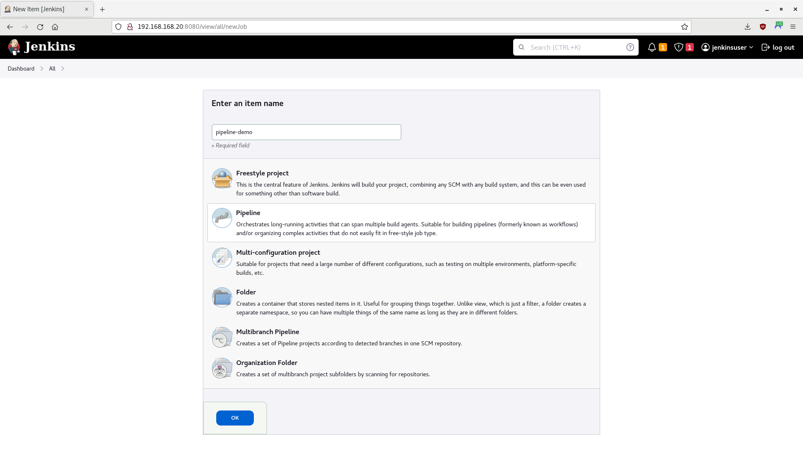

# Jenkins Container Demo (Automatic Setup)

> **NOTE** - These instructions will create a Jenkins container that is unlocked, configured with a default user, and with the recommended plugins (plus JUnit and Subversion) already installed; it does not require you to perform the normal initial setup process. However, unlike the Manual Setup, the containerfile will **NOT** enable an SSH service that can be accessed using Ansible. You will still be able to execute `sudo podman exec` commands, though.

In this tutorial, you will run a Jenkins automation server in a container, to manage continuous integration and continuous delivery (CI/CD) tasks.

- [Getting Started](#getting-started)
- [Create and Add the Jenkins Server Container to the Network](#create-and-add-the-jenkins-server-container-to-the-network)
- [Access Jenkins](#access-jenkins)
- [Add a Jenkinsfile to the Repository](#add-a-jenkinsfile-to-the-repository)
- [Summary](#summary)

> **WARNING** -  This is only a proof-of-concept demo for a single user! Do not use for production.

-----

## Getting Started

Perform the following tasks from the [Podman Network Demo](/01-podman-network/01-podman-network.md).

- [Environment](/01-podman-network/01-podman-network.md#environment)
- [Start Podman](/01-podman-network/01-podman-network.md#start-podman)
- [Create the Network](/01-podman-network/01-podman-network.md#create-the-network)

-----

## Create and Add the Jenkins Server Container to the Network

For this tutorial, you will use the freely available AlmaLinux 8 image as the operating system for your containers. However, you may use other comparable images, such as CentOS, Rocky Linux, or a Red Hat's Universal Base Image (UBI) (subscription required).

1. Open a Terminal, if one is not already open.

2. Create a Groovy Hook Script. Jenkins will run this script after it starts up:

    ```
    touch init.groovy
    ```

3. Using an editor of your choice, open `init.groovy` and add the following code:

    ```
    import jenkins.model.*
    import hudson.security.*

    def instance = Jenkins.getInstance()

    def hudsonRealm = new HudsonPrivateSecurityRealm(false)
    hudsonRealm.createAccount("jenkinsuser", "Change.Me.123")
    hudsonRealm.createAccount("admin", "Change.Me.321")
    instance.setSecurityRealm(hudsonRealm)

    def strategy = new FullControlOnceLoggedInAuthorizationStrategy()
    strategy.setAllowAnonymousRead(false)
    instance.setAuthorizationStrategy(strategy)

    instance.setInstallState(InstallState.INITIAL_SETUP_COMPLETED)

    instance.save()
    ```

4. Create a file to hold the list of plugins you want Jenkins to use. The `jenkins-plugin-manager.jar` file will read the list and install the plugins after Jenkins starts up:

    ```
    touch plugins.txt
    ```

5. Using an editor of your choice, open `plugins.txt` and add the following plugins:

    **NOTE** - This is a list of Jenkins' default and recommended plugins. It also includes the JUnit and Subversion plugins, which you will need for this tutorial. However, you can customize this list to fit your needs.

    ```
    cloudbees-folder
    antisamy-markup-formatter
    build-timeout
    credentials-binding
    timestamper
    ws-cleanup
    ant
    gradle
    workflow-aggregator
    github-branch-source
    pipeline-github-lib
    pipeline-stage-view
    git
    ssh-slaves
    matrix-auth
    pam-auth
    ldap
    email-ext
    mailer
    junit
    subversion
    ```

6. Create a containerfile:

    ```
    touch jenkins-auto.containerfile
    ```

7. Using an editor of your choice, open the `jenkins-auto.containerfile` and add the following code:

    ```
    FROM jenkins/jenkins:almalinux
    USER root

    # Ensure system is up-to-date
    RUN yum -y update &&\
        yum -y upgrade &&\
        yum -y clean all &&\
        yum -y autoremove

    # Skip initial setup
    ENV JAVA_OPTS -Djenkins.install.runSetupWizard=false

    # Use a Groovy script to configure the admin user
    COPY init.groovy /usr/share/jenkins/ref/init.groovy.d/

    # Install the recommended plugins, plus the JUnit and Subversion plugins
    # https://github.com/jenkinsci/jenkins/blob/master/core/src/main/resources/jenkins/install/platform-plugins.json
    COPY --chown=jenkins:jenkins plugins.txt /usr/share/jenkins/ref/plugins.txt
    RUN jenkins-plugin-cli --plugin-file /usr/share/jenkins/ref/plugins.txt

    # Ensure the passwd utility is installed
    RUN yum -y install passwd

    # Create a root password
    RUN echo Change.Me.321 | passwd root --stdin

    # Allow traffic through port 8080 (Jenkins)
    EXPOSE 8080
    ```

4. Build the image:

    > **NOTE** - Podman uses `/var/tmp` by default to download and build images. If a `No space left on device` error appears during the build, you can change the `image_copy_tmp_dir` setting in the `containers.conf` file, usually located in `/usr/share/containers/containers.conf`.

    ```
    # Optional; remove final and intermediate images if they exist
    sudo podman rmi jenkins_node_image --force
    sudo podman image prune --all --force
    # Build the image
    sudo podman build --rm --tag=jenkins_node_image --file=jenkins-auto.containerfile
    ```

5. Once complete, look at your image's information:

    ```
    sudo podman images
    ```

    **Output (other images may also appear):**

    ```
    REPOSITORY                    TAG         IMAGE ID      CREATED             SIZE
    localhost/jenkins_node_image  latest      73536a580d6f  About a minute ago  902 MB
    docker.io/library/almalinux   8           4e97feadb276  6 weeks ago         204 MB
    ...
    ```

    > **NOTE** - Any repositories named `<none>` that appear are intermediate images, used to build the final image. However, the `--rm` option should have told Podman to delete them after a successful build.

6. Using the new image, create an SVN node and attach it to the network:

    ```
    # Optional; stop and remove the node if it exists
    sudo podman stop jenkins_node
    sudo podman rm jenkins_node
    # Create the node and attach it to the network
    sudo podman run -dt --name jenkins_node --replace --restart=unless-stopped --net devnet --ip 192.168.168.20 --cap-add AUDIT_WRITE jenkins_node_image
    ```

7. Look at the containers:

    ```
    sudo podman ps --all
    ```

    **Output (other nodes may also appear):**

    ```
    CONTAINER ID  IMAGE                                COMMAND     CREATED             STATUS              PORTS       NAMES
    e01d98f007f5  localhost/jenkins_node_image:latest  /sbin/init  About a minute ago  Up About a minute               jenkins_node
    ...
    ```

8. Check the IPv4 addresses of the node; it should be `192.168.168.20`:

    ```
    sudo podman inspect jenkins_node -f '{{ .NetworkSettings.Networks.devnet.IPAddress }}'
    ```

-----

## Access Jenkins

1. Open a Terminal, if one is not already open.

2. Open a browser and navigate to the IPv4 address of the Jenkins server:

    ```
    firefox 192.168.168.20:8080
    ```

3. The Jenkins Login page should appear:

    > **NOTE** - Unlike the Manual Setup, you will not have to unlock Jenkins, nor perform further initial setup tasks. The `init.groovy` script unlocked Jenkins, set the admin user's password, and installed the desired plugins.

    

4. Enter ***"jenkinsuser"*** for the username and ***"Change.Me.123"*** for the password, then click on **Sign In**. The Jenkins Dashboard should appear:

    

5. At the Dashboard, click on **New Item** or navigate to `http://192.168.168.20:8080/view/all/newJob`. The Jenkins New Job page should appear. Enter ***"pipeline-demo"*** as the item name, select **Pipeline**, and click on **OK**:

    > **NOTE** - Ensure the SVN container you created in the [Subversion Container Demo](../02-svn-container/02-svn-container.md) is up and running first.

    

6. The Configuration page should appear:

    

7. Enter ***"Pipeline Demo Job"*** in the **Description** textbox.

8. Under **Build Triggers**, select **Poll SCM**. When **Schedule** appears, enter ***"H/2 * * * *"*** (this will poll the SVN server every two minutes).

9. Scroll down to the **Pipeline** section, and, under the **Definition** label, select **Pipeline script from SCM** from the dropdown list. This will allow you to run custom build, using a Jenkinsfile stored in your repository.

10. When the **SCM** dropdown list appears, select **Subversion**.

11. A new set of options should appear:

    - Enter ***"http://192.168.168.10/svn/demorepo"*** for the **Repository URL**.
    - Under **Credentials**, click **Add**, then click on the **Jenkins Credentials Provider** icon.
    - When the Jenkins Credentials Provider screen appears, enter ***"svnuser"*** for the username and ***"Change.Me.123"*** for the password, then click on **Add**.

       

    - Select the **svnuser** from the **Credentials** dropdown list.

12. Scroll down and uncheck the **Lightweight checkout** checkbox.

13. Click on **Save** when finished. The pipeline-demo job page should appear:

    

28. Wait two minutes and then refresh the page. The initial build should appear under **Build History**.

    > **NOTE** - No other builds will appear until there is a change in the repository.

    

-----

## Add a Jenkinsfile to the Repository

> **NOTE** - Ensure you have installed Subversion on the development host: `sudo yum -y install subversion`

1. Open a Terminal, if one is not already open.

2. Checkout the repository:

    ```
    svn checkout http://192.168.168.10/svn/demorepo/
    ```

3. If prompted for your sudo credentials, enter your password:

    ```
    Authentication realm: <http://192.168.168.10:80> SVN Repository
    Password for '<your username>': *************
    ```

4. When prompted for the repository credentials, enter ***"svnuser"*** for the username and ***"Change.Me.123"*** for the password:

    ```
    Authentication realm: <http://192.168.168.10:80> SVN Repository
    Username: svnuser
    Password for 'svnuser': *************
    ```

5. Navigate to the repository directory:

    ```
    cd demorepo
    ```

6.  Ensure your local repository is up-to-date with the remote repository. When prompted for the repository password, enter ***"Change.Me.123"***:

    ```
    svn update
    ```

7. Create a Jenkinsfile:

    ```
    touch Jenkinsfile
    ```

8. Using an editor of your choice, open the Jenkinsfile and add the following code:

    ```
    pipeline {
        agent any

        stages {
            stage('Build') {
                steps {
                    echo "Building ${env.JOB_NAME}..."
                }
            }
            stage('Test') {
                steps {
                    echo "Testing ${env.JOB_NAME}..."
                }
            }
            stage('Deploy') {
                steps {
                    echo "Deploying ${env.JOB_NAME}..."
                }
            }
        }
        post {
            success {
                echo "Good to go!"
            }
            failure {
                echo "Houston, we've had a problem."
            }
        }
    }
    ```

9. Add the Jenkinsfile to your local repository:

    ```
    svn add . --force
    ```

10. Push your changes to the remote repository. When prompted for the repository password, enter ***"Change.Me.123"***:

    ```
    svn commit -m "Added Jenkinsfile."
    ```

11. Return to Jenkins. Wait two minutes and then refresh. Another build should appear under **Build History**, along with the **Stage View***:

    

12. Now that there is a Jenkinsfile in the repository, Jenkins will run it every time there is a change in the repository. You can use the Jenkinsfile to run unit test, scans, and deploy code to a server.

    > **NOTE** - If you want to rerun the Jenkinsfile, simply click **Build Now**.
    
13. Click on the build under **Build History**. The build page should appear:

    

14. On the **Build** page, click on the **Console Output** link:

15. Look through the output, and you will see comments for each stage, as well as the success message of "Good to go!":

16. Click on the **pipeline-demo** link at the top of the page to return to the project page.

-----

## Summary

In this tutorial, you ran a Jenkins automation server in a container, pulling code from a Subversion server and running a build using a Jenkinsfile. Remember, this is only a proof-of-concept demo for a single user; you should not use it for production.