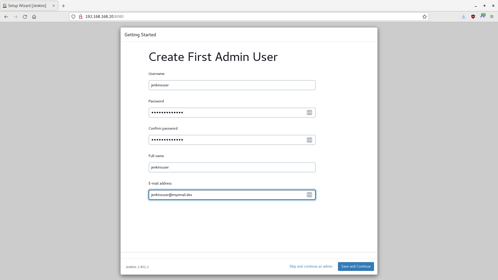
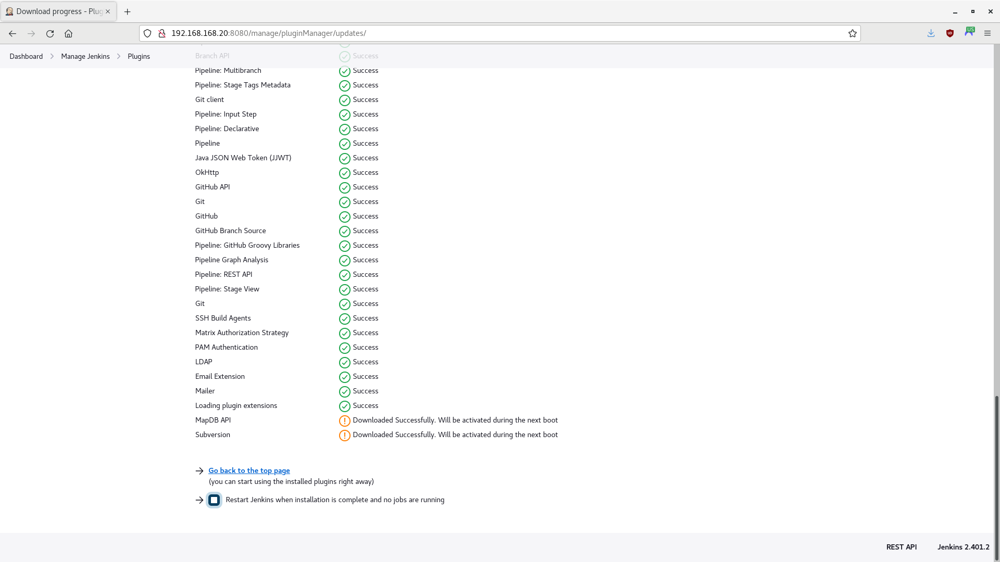
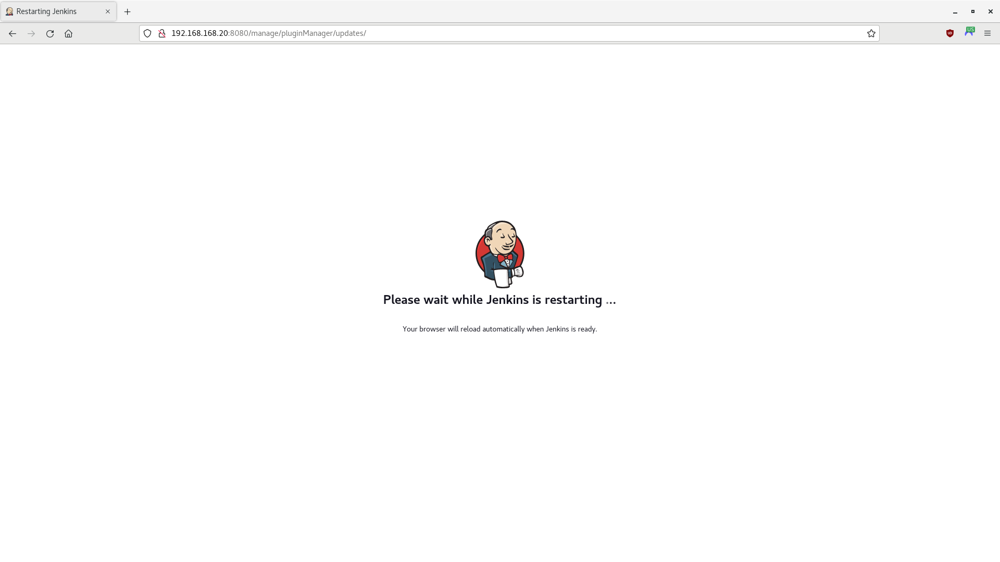

# Jenkins Container Demo (Manual Setup)

> **NOTE** - These instructions will create a Jenkins container that requires the normal initial setup (i.e., unlocking Jenkins, creating an admin user, etc.). However, unlike the Automatic Setup, the containerfile will also enable an SSH service, which will allow you to manage the container using Ansible.

In this tutorial, you will run a Jenkins automation server in a container, to manage continuous integration and continuous delivery (CI/CD) tasks.

- [Getting Started](#getting-started)
- [Create and Add the Jenkins Server Container to the Network](#create-and-add-the-jenkins-server-container-to-the-network)
- [Access Jenkins](#access-jenkins)
- [Add a Jenkinsfile to the Repository](#add-a-jenkinsfile-to-the-repository)
- [Summary](#summary)

> **WARNING** -  This is only a proof-of-concept demo for a single user! Do not use for production.

-----

## Getting Started

Perform the following tasks from the [Podman Network Demo](/01-podman-network/01-podman-network.md).

- [Environment](/01-podman-network/01-podman-network.md#environment)
- [Start Podman](/01-podman-network/01-podman-network.md#start-podman)
- [Create the Network](/01-podman-network/01-podman-network.md#create-the-network)


-----

## Create and Add the Jenkins Server Container to the Network

For this tutorial, you will use the freely available AlmaLinux 8 image as the operating system for your containers. However, you may use other comparable images, such as CentOS, Rocky Linux, or a Red Hat's Universal Base Image (UBI) (subscription required).

1. Open a Terminal, if one is not already open.

2. Create a containerfile:

    ```
    touch jenkins-manual.containerfile
    ```

3. Using an editor of your choice, open the `jenkins-manual.containerfile` and add the following code:

    ```
    # Pull a Docker or Podman image. For this demo, you will use AlmaLinux 8
    FROM almalinux:8

    # Ensure system is up-to-date
    RUN yum -y update &&\
        yum -y upgrade &&\
        yum -y clean all &&\
        yum -y autoremove

    # Ensure the passwd utility is installed
    RUN yum -y install passwd

    # Create a non-root user and create a root password
    # useradd  --comment "Default User Account" --create-home -groups wheel user
    RUN useradd -c "Default User Account" -m -G wheel user &&\
        echo Change.Me.123 | passwd user --stdin &&\
        echo Change.Me.321 | passwd root --stdin

    # Adapted from https://access.redhat.com/solutions/7015042
    # Install openssh, httpd, and sudo
    RUN yum -y install openssh openssh-askpass openssh-clients openssh-server &&\
        yum -y install httpd &&\
        yum -y install sudo

    # Enable the HTTP and SSH daemons
    RUN systemctl enable httpd &&\
        systemctl enable sshd

    # Customize the SSH daemon
    RUN mkdir /var/run/sshd &&\
        ssh-keygen -A &&\
        cp /etc/ssh/sshd_config /etc/ssh/sshd_config.bak &&\
        sed -i 's/PermitRootLogin prohibit-password/PermitRootLogin yes/' /etc/ssh/sshd_config &&\
        cp /etc/pam.d/sshd /etc/pam.d/sshd.bak &&\
        sed 's@session\s*required\s*pam_loginuid.so@#session optional pam_loginuid.so@g' -i /etc/pam.d/sshd

    # Prevent 'System is booting up. Unprivileged users are not permitted to log in yet' error when not root
    # Do not exit on error if the directory does not exist: rm /run/nologin || true
    RUN rm /run/nologin || :

    # Pass environment variables 
    # https://stackoverflow.com/questions/36292317/why-set-visible-now-in-etc-profile
    ENV NOTVISIBLE "in users profile"
    RUN echo "export VISIBLE=now" >> /etc/profile

    # Install Java and fontconfig
    RUN yum -y install java-11-openjdk-devel fontconfig

    # Install the wget tool to fetch the Jenkins repository:
    RUN yum -y install wget

    # Get the Jenkins repo and key
    RUN wget -O /etc/yum.repos.d/jenkins.repo https://pkg.jenkins.io/redhat-stable/jenkins.repo &&\
        rpm --import https://pkg.jenkins.io/redhat-stable/jenkins.io-2023.key &&\
        yum makecache

    # Install Jenkins
    RUN yum -y install jenkins

    # Enable Jenkins as a service
    RUN systemctl enable jenkins

    # Allow traffic through ports 22 (SSH), 80 (HTTP), and 8080 (Jenkins)
    EXPOSE 22 80 8080

    # Start the systemd service
    # https://access.redhat.com/documentation/en-us/red_hat_enterprise_linux_atomic_host/7/html/managing_containers/running_containers_as_systemd_services_with_podman#starting_services_within_a_container_using_systemd
    CMD [ "/sbin/init" ]
    ```

4. Build the image:

    > **NOTE** - Podman uses `/var/tmp` by default to download and build images. If a `No space left on device` error appears during the build, you can change the `image_copy_tmp_dir` setting in the `containers.conf` file, usually located in `/usr/share/containers/containers.conf`.

    ```
    # Optional; remove final and intermediate images if they exist
    sudo podman rmi jenkins_node_image --force
    sudo podman image prune --all --force
    # Build the image
    sudo podman build --rm --tag=jenkins_node_image --file=jenkins-manual.containerfile
    ```

5. Once complete, look at your image's information:

    ```
    sudo podman images
    ```

    **Output (other images may also appear):**

    ```
    REPOSITORY                    TAG         IMAGE ID      CREATED             SIZE
    localhost/jenkins_node_image  latest      73536a580d6f  About a minute ago  902 MB
    docker.io/library/almalinux   8           4e97feadb276  6 weeks ago         204 MB
    ...
    ```

    > **NOTE** - Any repositories named `<none>` that appear are intermediate images, used to build the final image. However, the `--rm` option should have told Podman to delete them after a successful build.

6. Using the new image, create an SVN node and attach it to the network:

    ```
    # Optional; stop and remove the node if it exists
    sudo podman stop jenkins_node
    sudo podman rm jenkins_node
    # Create the node and attach it to the network
    sudo podman run -dt --name jenkins_node --replace --restart=unless-stopped --net devnet --ip 192.168.168.20 --cap-add AUDIT_WRITE jenkins_node_image
    ```

7. Look at the containers:

    ```
    sudo podman ps --all
    ```

    **Output (other nodes may also appear):**

    ```
    CONTAINER ID  IMAGE                                COMMAND     CREATED             STATUS              PORTS       NAMES
    e01d98f007f5  localhost/jenkins_node_image:latest  /sbin/init  About a minute ago  Up About a minute               jenkins_node
    ...
    ```

8. Check the IPv4 addresses of the node; it should be `192.168.168.20`:

    ```
    sudo podman inspect jenkins_node -f '{{ .NetworkSettings.Networks.devnet.IPAddress }}'
    ```

-----

## Access Jenkins

1. Open a Terminal, if one is not already open.

2. Open a browser and navigate to the IPv4 address of the Jenkins server:

    ```
    firefox 192.168.168.20:8080
    ```

3. A web page should appear, asking you to unlock Jenkins:

    

4. In the Terminal, follow the instructions and look at the contents of `/var/lib/jenkins/secrets/initialAdminPassword`:

    - Using `podman exec`:

        ```
        sudo podman exec jenkins_node cat /var/lib/jenkins/secrets/initialAdminPassword
        ```

    - Using SSH as `root`; enter ***"Change.Me.321"*** when prompted for a password:

        ```
        ssh -o StrictHostKeyChecking=no -o UserKnownHostsFile=/dev/null root@192.168.168.20
        java -jar /usr/share/java/jenkins.war --version
        cat /var/lib/jenkins/secrets/initialAdminPassword
        logout
        ```

5. Return to Jenkins and enter the password. A web page should appear, asking you to customize Jenkins:

    

6. Select **Install suggested plugins** for now. Jenkins will begin its setup process:

    

    > **NOTE** - If any plugins fail to install properly, retry. Sometimes, a plugin requires another plugin, causing a race condition, and a retry may fix the problem.

7. A web page should appear, asking you to create the first admin user:

    

8. Enter the following information:

    - Username: ***jenkinsuser***
    - Password: ***Change.Me.123***
    - Confirm password: ***Change.Me.123***
    - Full name: ***Jenkins User***
    - E-mail address: <***Enter your email address***>

9. A web page should appear, asking you to verify the Jenkins URL:

    

10. Click on **Save and Finish**. A web page should appear, telling you that Jenkins is ready:

    

11. Click on **Start using Jenkins**. The Jenkins Dashboard should appear:

    

12. By default, Jenkins uses the Git version control system. To use Subversion with Jenkins, you must install the Subversion plugin. Click on **Manage Jenkins** or navigate to `http://192.168.168.20:80808/manage`. The Mangage Jenkins page should appear:

    > **NOTE** - Ignore any errors or issues for now. Restarting Jenkins should fix these issues, which you will do shortly.

    

13. Click on **Plugins** or navigate to `http://192.168.168.20:80808/manage/pluginManager`. The Plugins page should appear:

    

14. Click on **Available Plugins** or navigate to http://192.168.168.20:80808/manage/pluginManager/available. A list of available plugins should appear. Enter `subversion` in the search box; the **Subversion** plugin should appear at the top of the list. Check the **Install** box next to the plugin:

    

15. Click on **Download now and install after restart**. The Download progress page should appear:

    

16. Scroll to the bottom of the page:

    

17. Click on **Restart Jenkins when installation is complete and no jobs are running**. A web page should appear, asking you to please wait while Jenkins restarts:

    

18. After a few minutes, the Jenkins Login page should appear:

    

19. Enter ***"jenkinsuser"*** for the username and ***"Change.Me.123"*** for the password, then click on **Sign In**. If the Download progress page reappears, click on **Go back to the top page** to return to the Dashboard:

    

5. At the Dashboard, click on **New Item** or navigate to `http://192.168.168.20:8080/view/all/newJob`. The Jenkins New Job page should appear. Enter ***"pipeline-demo"*** as the item name, select **Pipeline**, and click on **OK**:

    > **NOTE** - Ensure the SVN container you created in the [Subversion Container Demo](../02-svn-container/02-svn-container.md) is up and running first.

    

6. The Configuration page should appear:

    

7. Enter ***"Pipeline Demo Job"*** in the **Description** textbox.

8. Under **Build Triggers**, select **Poll SCM**. When **Schedule** appears, enter ***"H/2 * * * *"*** (this will poll the SVN server every two minutes).

9. Scroll down to the **Pipeline** section, and, under the **Definition** label, select **Pipeline script from SCM** from the dropdown list. This will allow you to run custom build, using a Jenkinsfile stored in your repository.

10. When the **SCM** dropdown list appears, select **Subversion**.

11. A new set of options should appear:

    - Enter ***"http://192.168.168.10/svn/demorepo"*** for the **Repository URL**.
    - Under **Credentials**, click **Add**, then click on the **Jenkins Credentials Provider** icon.
    - When the Jenkins Credentials Provider screen appears, enter ***"svnuser"*** for the username and ***"Change.Me.123"*** for the password, then click on **Add**.

       

    - Select the **svnuser** from the **Credentials** dropdown list.

12. Scroll down and uncheck the **Lightweight checkout** checkbox.

13. Click on **Save** when finished. The pipeline-demo job page should appear:

    

28. Wait two minutes and then refresh the page. The initial build should appear under **Build History**.

    > **NOTE** - No other builds will appear until there is a change in the repository.

    

-----

## Add a Jenkinsfile to the Repository

> **NOTE** - Ensure you have installed Subversion on the development host: `sudo yum -y install subversion`

1. Open a Terminal, if one is not already open.

2. Checkout the repository:

    ```
    svn checkout http://192.168.168.10/svn/demorepo/
    ```

3. If prompted for your sudo credentials, enter your password:

    ```
    Authentication realm: <http://192.168.168.10:80> SVN Repository
    Password for '<your username>': *************
    ```

4. When prompted for the repository credentials, enter ***"svnuser"*** for the username and ***"Change.Me.123"*** for the password:

    ```
    Authentication realm: <http://192.168.168.10:80> SVN Repository
    Username: svnuser
    Password for 'svnuser': *************
    ```

5. Navigate to the repository directory:

    ```
    cd demorepo
    ```

6.  Ensure your local repository is up-to-date with the remote repository. When prompted for the repository password, enter ***"Change.Me.123"***:

    ```
    svn update
    ```

7. Create a Jenkinsfile:

    ```
    touch Jenkinsfile
    ```

8. Using an editor of your choice, open the Jenkinsfile and add the following code:

    ```
    pipeline {
        agent any

        stages {
            stage('Build') {
                steps {
                    echo "Building ${env.JOB_NAME}..."
                }
            }
            stage('Test') {
                steps {
                    echo "Testing ${env.JOB_NAME}..."
                }
            }
            stage('Deploy') {
                steps {
                    echo "Deploying ${env.JOB_NAME}..."
                }
            }
        }
        post {
            success {
                echo "Good to go!"
            }
            failure {
                echo "Houston, we've had a problem."
            }
        }
    }
    ```

9. Add the Jenkinsfile to your local repository:

    ```
    svn add . --force
    ```

10. Push your changes to the remote repository. When prompted for the repository password, enter ***"Change.Me.123"***:

    ```
    svn commit -m "Added Jenkinsfile."
    ```

11. Return to Jenkins. Wait two minutes and then refresh. Another build should appear under **Build History**, along with the **Stage View***:

    

12. Now that there is a Jenkinsfile in the repository, Jenkins will run it every time there is a change in the repository. You can use the Jenkinsfile to run unit test, scans, and deploy code to a server.

    > **NOTE** - If you want to rerun the Jenkinsfile, simply click **Build Now**.
    
13. Click on the build under **Build History**. The build page should appear:

    

14. On the **Build** page, click on the **Console Output** link:

15. Look through the output, and you will see comments for each stage, as well as the success message of "Good to go!":

16. Click on the **pipeline-demo** link at the top of the page to return to the project page.

-----

## Summary

In this tutorial, you ran a Jenkins automation server in a container, pulling code from a Subversion server and running a build using a Jenkinsfile. Remember, this is only a proof-of-concept demo for a single user; you should not use it for production.