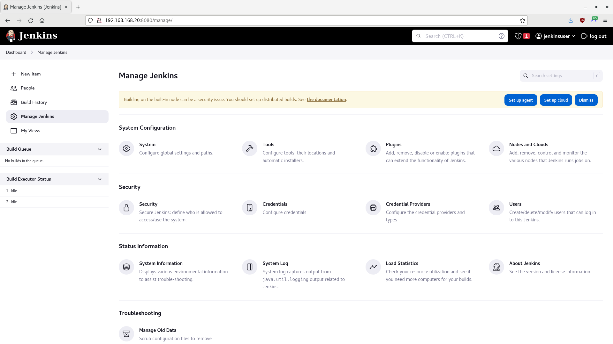
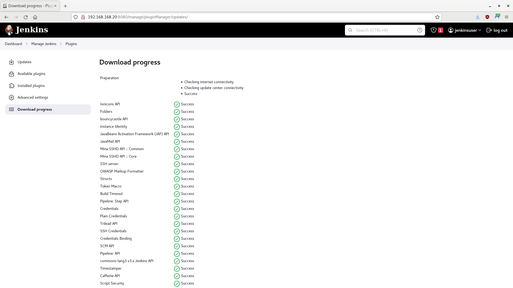
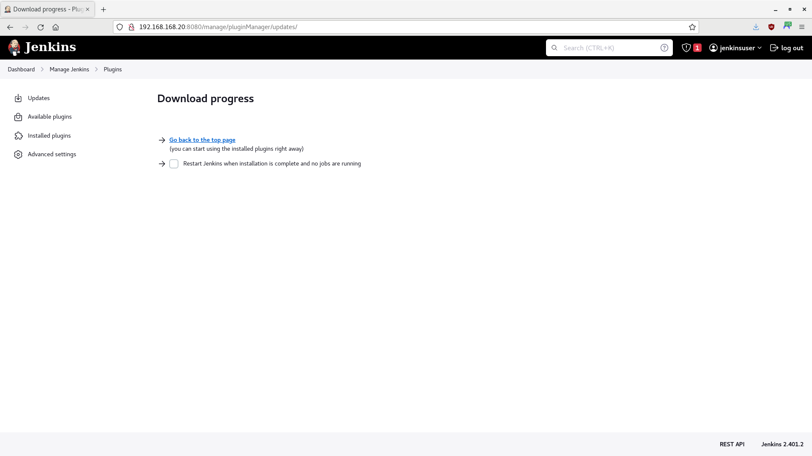

# Jenkins Container Demo

In this tutorial, you will run a Jenkins automation server in a container, to manage continuous integration and continuous delivery (CI/CD) tasks.

- [Getting Started](#getting-started)
- [Create and Add the Jenkins Server Container to the Network](#create-and-add-the-jenkins-server-container-to-the-network)
- [Access Jenkins](#access-jenkins)
- [Summary](#summary)

> **WARNING** -  This is only a proof-of-concept demo for a single user! Do not use for production.

-----

## Getting Started

Perform the following tasks from the [Podman Network Demo](/01-podman-network/01-podman-network.md).

- [Environment](/01-podman-network/01-podman-network.md#environment)
- [Start Podman](/01-podman-network/01-podman-network.md#start-podman)
- [Create the Network](/01-podman-network/01-podman-network.md#create-the-network)


-----

## Create and Add the Jenkins Server Container to the Network

For this tutorial, you will use the freely available Rocky Linux 8 image as the operating system for your containers. However, you may use other comparable images, such as Alma Linux or a Red Hat's Universal Base Image (UBI) (subscription required).

1. Open a Terminal, if one is not already open.

2. Create a containerfile:

    ```
    touch jenkins.containerfile
    ```

3. Using an editor of your choice, open `jenkins.containerfile` and add the following code:

    ```
    # Pull a Docker or Podman image. For this demo, you will use Rocky Linux 8
    FROM rockylinux:8

    # Ensure system is up-to-date
    RUN yum -y update &&\
    yum -y upgrade &&\
    yum -y clean all

    # Ensure the passwd utility is installed
    RUN yum -y install passwd

    # Create a non-root user and create a root password
    # useradd  --comment "Default User Account" --create-home -groups wheel user
    RUN useradd -c "Default User Account" -m -G wheel user &&\
    echo Change.Me.123 | passwd user --stdin &&\
    echo Change.Me.321 | passwd root --stdin

    # Adapted from https://access.redhat.com/solutions/7015042
    # Install openssh, httpd, and sudo
    RUN yum -y install openssh openssh-askpass openssh-clients openssh-server &&\
    yum -y install httpd &&\
    yum -y install sudo

    # Enable the HTTP and SSH daemons
    RUN systemctl enable httpd &&\
    systemctl enable sshd

    # Customize the SSH daemon
    RUN mkdir /var/run/sshd &&\
    ssh-keygen -A &&\
    cp /etc/ssh/sshd_config /etc/ssh/sshd_config.bak &&\
    sed -i 's/PermitRootLogin prohibit-password/PermitRootLogin yes/' /etc/ssh/sshd_config &&\
    cp /etc/pam.d/sshd /etc/pam.d/sshd.bak &&\
    sed 's@session\s*required\s*pam_loginuid.so@#session optional pam_loginuid.so@g' -i /etc/pam.d/sshd

    # Prevent 'System is booting up. Unprivileged users are not permitted to log in yet' error when not root
    RUN rm /run/nologin

    # Pass environment variables 
    # https://stackoverflow.com/questions/36292317/why-set-visible-now-in-etc-profile
    ENV NOTVISIBLE "in users profile"
    RUN echo "export VISIBLE=now" >> /etc/profile

    # Install Java and fontconfig
    RUN yum -y install java-11-openjdk-devel fontconfig

    # Install the wget tool to fetch the Jenkins repository:
    RUN yum -y install wget

    # Get the Jenkins repo and key
    RUN wget -O /etc/yum.repos.d/jenkins.repo https://pkg.jenkins.io/redhat-stable/jenkins.repo
    RUN rpm --import https://pkg.jenkins.io/redhat-stable/jenkins.io-2023.key

    # Install Jenkins and enable after restart
    RUN yum -y install jenkins &&\
        systemctl enable jenkins

    # Allow traffic through ports 22 (SSH), 80 (HTTP), and 8080 (Jenkins)
    EXPOSE 22 80 8080

    # Start the systemd service
    # https://access.redhat.com/documentation/en-us/red_hat_enterprise_linux_atomic_host/7/html/managing_containers/running_containers_as_systemd_services_with_podman#starting_services_within_a_container_using_systemd
    CMD [ "/sbin/init" ]
    ```

4. Build the image:

    > **NOTE** - Podman uses `/var/tmp` by default to download and build images. If a `No space left on device` error appears during the build, you can change the `image_copy_tmp_dir` setting in the `containers.conf` file, usually located in `/usr/share/containers/containers.conf`.

    ```
    # Optional; remove final and intermediate images if they exist
    sudo podman rmi jenkins_node_image --force
    sudo podman image prune --all --force
    # Build the image
    sudo podman build --rm --tag=jenkins_node_image --file=jenkins.containerfile
    ```

5. Once complete, look at your image's information:

    ```
    sudo podman images
    ```

    **Output (other images may also appear):**

    ```
    REPOSITORY                    TAG         IMAGE ID      CREATED             SIZE
    localhost/jenkins_node_image  latest      73536a580d6f  About a minute ago  902 MB
    docker.io/library/rockylinux  8           4e97feadb276  6 weeks ago         204 MB
    ...
    ```

    > **NOTE** - Any repositories named `<none>` that appear are intermediate images, used to build the final image. However, the `--rm` option should have told Podman to delete them after a successful build.

6. Using the new image, create an SVN node and attach it to the network:

    ```
    # Optional; stop and remove the node if it exists
    sudo podman stop jenkins_node
    sudo podman rm jenkins_node
    # Create the node and attach it to the network
    sudo podman run -dt --name jenkins_node --replace --restart=unless-stopped --net devnet --ip 192.168.168.20 --cap-add AUDIT_WRITE jenkins_node_image
    ```

7. Look at the containers:

    ```
    sudo podman ps --all
    ```

    **Output (other nodes may also appear):**

    ```
    CONTAINER ID  IMAGE                                COMMAND     CREATED             STATUS              PORTS       NAMES
    e01d98f007f5  localhost/jenkins_node_image:latest  /sbin/init  About a minute ago  Up About a minute               jenkins_node
    ...
    ```

8. Check the IPv4 addresses of the node; it should be `192.168.168.20`:

    ```
    sudo podman inspect jenkins_node -f '{{ .NetworkSettings.Networks.devnet.IPAddress }}'
    ```

-----

## Access Jenkins

1. Open a Terminal, if one is not already open.

2. Open a browser and navigate to the IPv4 address of the Jenkins server:

    ```
    firefox 192.168.168.20:8080
    ```

3. A web page should appear, asking you to unlock Jenkins:

    

4. In the Terminal, access the Jenkins Server, using SSH as `root`; enter `Change.Me.321` when prompted for a password:

    ```
    ssh -o StrictHostKeyChecking=no -o UserKnownHostsFile=/dev/null root@192.168.168.20
    ```

5. Follow Jenkins' instructions and look at the contents of `/var/lib/jenkins/secrets/initialAdminPassword`; the initial admin password should appear:

    ```
    cat /var/lib/jenkins/secrets/initialAdminPassword
    ```

6. Copy or record the password. Log out when finished:

    ```
    logout
    ```

7. Return to Jenkins and enter the password. A web page should appear, asking you to customize Jenkins:

    

8. Select **Install suggested plugins** for now. Jenkins will begin its setup process:

    

    > **NOTE** - If any plugins fail to install properly, retry. Sometimes, a plugin requires another plugin, causing a race condition, and a retry may fix the problem.

9. A web page should appear, asking you to create the first admin user:

    

10. Enter the following information:

    - Username: ***jenkinsuser***
    - Password: ***Change.Me.123***
    - Confirm password: ***Change.Me.123***
    - Full name: ***Jenkins User***
    - E-mail address: <***Enter your email address***>

11. A web page should appear, asking you to verify the Jenkins URL:

    

12. Click on **Save and Finish**. A web page should appear, telling you that Jenkins is ready:

    

13. Click on **Start using Jenkins**. The Jenkins Dashboard should appear:

    

14. By default, Jenkins uses the Git version control system. To use Subversion with Jenkins, you must install the Subversion plugin. Click on **Manage Jenkins** or navigate to `http://192.168.168.20:80808/manage`. The Mangage Jenkins page should appear:

    > **NOTE** - Ignore any errors or issues for now. Restarting Jenkins should fix these issues, which you will do shortly.

    

15. Click on **Plugins** or navigate to `http://192.168.168.20:80808/manage/pluginManager`. The Plugins page should appear:

    

16. Click on **Available Plugins** or navigate to http://192.168.168.20:80808/manage/pluginManager/available. A list of available plugins should appear. Enter `subversion` in the search box; the **Subversion** plugin should appear at the top of the list. Check the **Install** box next to the plugin:

    

17. Click on **Download now and install after restart**. The Download progress page should appear:

    

18. Scroll to the bottom of the page:

    

19. Click on **Restart Jenkins when installation is complete and no jobs are running**. A web page should appear, asking you to please wait while Jenkins restarts:

    

20. After a few minutes, the Jenkins Login page should appear:

    

21. Enter `jenkinsuser` for the username and `Change.Me.123` for the password, then click on **Sign In**. If the Download progress page reappears, click on **Go back to the top page** to return to the Dashboard:

    

22. At the Dashboard, click on **New Item** or navigate to `http://192.168.168.20:8080/view/all/newJob`. The Jenkins New Job page should appear. Enter `pipeline-demo` as the item name, select **Freestyle project**, and click on **OK**:

    > **NOTE** - Ensure the SVN container is up and running first.

    

23. The Configuration page should appear:

    

24. Enter `Pipeline Demo Job` in the **Description** textbox and select `Subversion` for **Source Code Management**.

25. A new set of options should appear:

    - Enter `http://192.168.168.10/svn/demorepo` for the **Repository URL**.
    - Under **Credentials**, click **Add**, then click on the **Jenkins Credentials Provider** icon.
    - When the Jenkins Credentials Provider screen appears, enter `svnuser` for the username and `Change.Me.123` for the password, then click on **Add**.

       

    - Select the **svnuser** from the **Credentials** dropdown list.

26. Under **Build Triggers**, select **Poll SCM**. When **Schedule** appears, enter `H/2 * * * *` (this will poll the SVN server every two minutes).

27. Click on **Save** when finished. The pipeline-demo job page should appear:

    

28. Wait two minutes and then refresh. The initial build should appear.

    > **NOTE** - No other builds will appear until there is a change in the repository.

    

-----

## Summary

In this tutorial, you ran a Jenkins automation server in a container, integrated with the Subversion server. Remember, this is only a proof-of-concept demo for a single user; you should not use it for production.