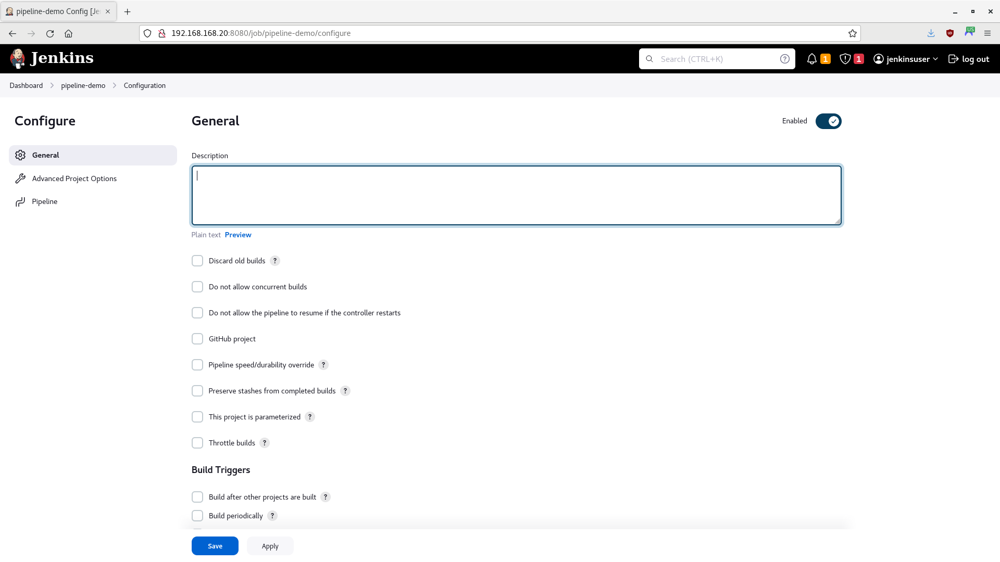

# Jenkins Container Demo

In this tutorial, you will run a Jenkins automation server in a container, to manage continuous integration and continuous delivery (CI/CD) tasks.

- [Getting Started](#getting-started)
- [Create and Add the Jenkins Server Container to the Network](#create-and-add-the-jenkins-server-container-to-the-network)
- [Create a Pipeline](#create-a-pipeline)
- [Add a Jenkinsfile to the Repository](#add-a-jenkinsfile-to-the-repository)
- [Summary](#summary)

> **WARNING** -  This is only a proof-of-concept demo for a single user! Do not use for production.

-----

## Getting Started

1. Ensure you have completed the steps in the [Subversion Container Demo](/02-svn-container/02-svn-container.md).

2. Ensure that the following containers are running:

    - Subversion: `sudo podman start svn_node`

3. Ensure that the **svn-root** volume exists: `sudo podman volume inspect svn-root`

-----

## Create and Add the Jenkins Server Container to the Network

For this tutorial, you will use the freely available AlmaLinux 8 image as the operating system for your containers. However, you may use other comparable images, such as CentOS, Rocky Linux, or a Red Hat's Universal Base Image (UBI) (subscription required).

You have two options:

- **[Manual Setup](/03-jenkins-container/03-jenkins-container-manual.md)**: These instructions will create a Jenkins container that requires the normal initial setup (i.e., unlocking Jenkins, creating an admin user, installing plugins). However, unlike the [Automatic Setup](/03-jenkins-container/03-jenkins-container-auto.md), the containerfile will also enable an SSH service, which will allow you to manage the container using Ansible.

- **[Automatic Setup](/03-jenkins-container/03-jenkins-container-auto.md)**: These instructions will create a Jenkins container that is unlocked, configured with an admin user, and with the recommended plugins (plus Subversion and JUnit) already installed; it will not require you to perform the normal initial setup process for Jemkins. However, unlike the [Manual Setup](/03-jenkins-container/03-jenkins-container-manual.md), the containerfile will **NOT** enable an SSH service that can be accessed using Ansible. You will still be able to execute `sudo podman exec jenkins_node` commands, though.

Once you have set up Jenkins, return here and continue the tutorial.

-----

## Create a Pipeline

1. At the Dashboard, click on **New Item** or navigate to `http://192.168.168.20:8080/view/all/newJob`. The Jenkins New Job page should appear. Enter ***"pipeline-demo"*** as the item name, select **Pipeline**, and click on **OK**:

    > **NOTE** - Ensure the SVN container you created in the [Subversion Container Demo](../02-svn-container/02-svn-container.md) is up and running first.

    

2. The Configuration page should appear:

    

3. In the **General** section, enter ***"Pipeline Demo Job"*** in the **Description** textbox.

4. Scroll down to the **Build Triggers** section and select **Poll SCM**. A new set of options should appear:

    - **Schedule**: Enter ***"H/2 \* \* \* \*"*** (this will poll the SVN server every two minutes).

5. Scroll down to the **Pipeline** section and enter the following script:

    ```groovy
    pipeline {
        agent any

        stages {
            stage('Hello') {
                steps {
                    echo 'Hello World'
                }
            }
        }
    }
    ```

6. Click on **Save** when finished. The pipeline-demo job page should appear:

    

7. Wait two minutes, then refresh the page. The initial build should appear under **Build History**, along with the **Stage View**:

    > **NOTE** - No other builds will appear until there is a change in the repository or configuration.

    

8. Click on the build (**#1**) under **Build History**. The build page should appear:

    

9. On the **Build** page, click on the **Console Output** link. Look through the output, and you will see "Hello, World!":

    

10. Click on the **pipeline-demo** link at the top of the page to return to the project page.

-----

## Add a Jenkinsfile to the Repository

> **NOTE** - Ensure you have installed Subversion on the development host: `sudo yum -y install subversion`

1. If it is not already open, access Jenkins in the browser and open the **pipline-demo** project:

    

2. Click on **Configure**.

3. Scroll down to the **Pipeline** section and select **Pipeline script from SCM** from the **Definition** dropdown list. This will allow you to run custom build, using a Jenkinsfile stored in your repository.

4. Select **Subversion** from the **SCM** dropdown list. A new set of options should appear:

    - **Repository URL**: Enter ***"<http://192.168.168.10/svn/demorepo>"***.
    - **Credentials**:
        - Click **Add**, then click on the **Jenkins Credentials Provider** button.
        - When the Jenkins Credentials Provider screen appears, enter ***"svnuser"*** for the username and ***"Change.Me.123"*** for the password, then click on **Add**.

            

        - Go back to the **Credentials** dropdown list and select the **svnuser**.

5. Scroll down and uncheck the **Lightweight checkout** checkbox.

6. Click on **Save** when finished. The pipeline-demo job page should reappear:

    

7. Open a Terminal, if one is not already open.

8. Checkout the repository:

    ```bash
    svn checkout http://192.168.168.10/svn/demorepo/
    ```

9. If prompted for your sudo credentials, enter your password:

    ```bash
    Authentication realm: <http://192.168.168.10:80> SVN Repository
    Password for '<your username>': *************
    ```

10. When prompted for the repository credentials, enter ***"svnuser"*** for the username and ***"Change.Me.123"*** for the password:

    ```bash
    Authentication realm: <http://192.168.168.10:80> SVN Repository
    Username: svnuser
    Password for 'svnuser': *************
    ```

11. Navigate to the repository directory:

    ```bash
    cd demorepo
    ```

12. Ensure your local repository is up-to-date with the remote repository. When prompted for the repository password, enter ***"Change.Me.123"***:

    ```bash
    svn update
    ```

13. Create a Jenkinsfile:

    ```bash
    touch Jenkinsfile
    ```

14. Using an editor of your choice, open the Jenkinsfile and add the following code:

    ```groovy
    pipeline {
        agent any

        stages {
            stage('Build') {
                steps {
                    echo "Building ${env.JOB_NAME}..."
                }
            }
            stage('Test') {
                steps {
                    echo "Testing ${env.JOB_NAME}..."
                }
            }
            stage('Deploy') {
                steps {
                    echo "Deploying ${env.JOB_NAME}..."
                }
            }
        }
        post {
            success {
                echo "Good to go!"
            }
            failure {
                echo "Houston, we've had a problem."
            }
        }
    }
    ```

15. Add the Jenkinsfile to your local repository:

    ```bash
    svn add . --force
    ```

16. Push your changes to the remote repository. When prompted for the repository password, enter ***"Change.Me.123"***:

    ```bash
    svn commit -m "Added Jenkinsfile."
    ```

17. Go back to Jenkins, wait two minutes for Jenkins to contact the SVN server, then refresh the page. Another build should appear under **Build History**, along with the **Stage View**:

    > **NOTE** - If refresh does not work, click on **Build Now**.

    

18. Now that there is a Jenkinsfile in the repository, Jenkins will run it every time there is a change in the repository. You can use the Jenkinsfile to run tests, scans, and to deploy code to a server.

    > **NOTE** - If you want to re-run the Jenkinsfile, simply click **Build Now**.

19. Click on the build (**#2**) under **Build History**. The build page should appear:

    

20. On the **Build** page, click on the **Console Output** link. Look through the output, and you will see comments for each stage, as well as the success message of "Good to go!":

    

21. Click on the **pipeline-demo** link at the top of the page to return to the project page.

-----

## Summary

In this tutorial, you ran a Jenkins automation server in a container, pulling code from a Subversion server and running a build using a Jenkinsfile. Please continue to our [Pipeline Testing Stage Demo](/04-testing-stage/04-testing-stage.md). Remember, this is only a proof-of-concept demo for a single user; you should not use it for production.
