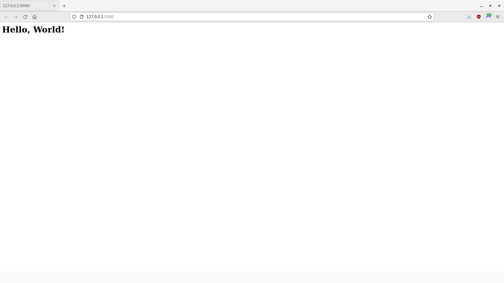
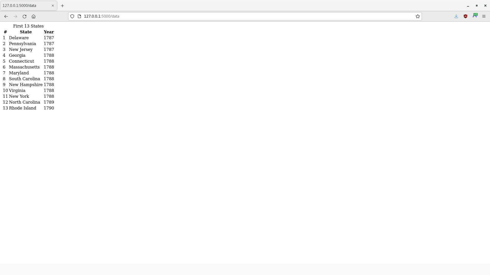
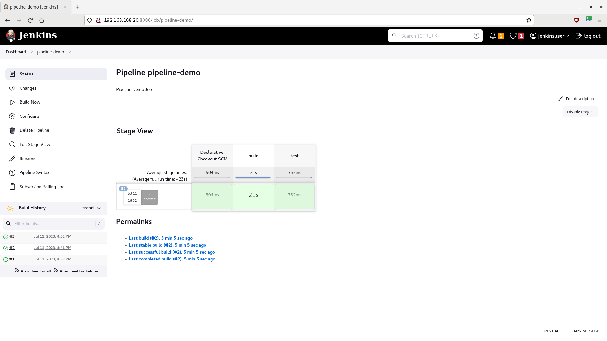
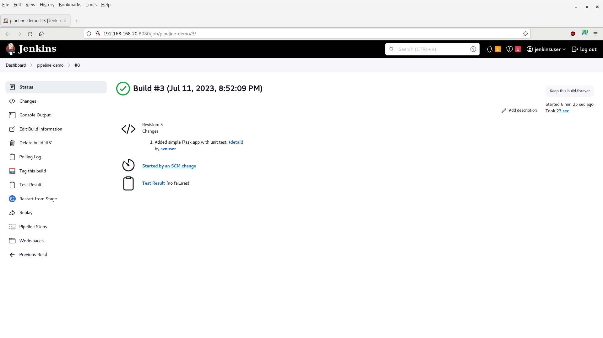
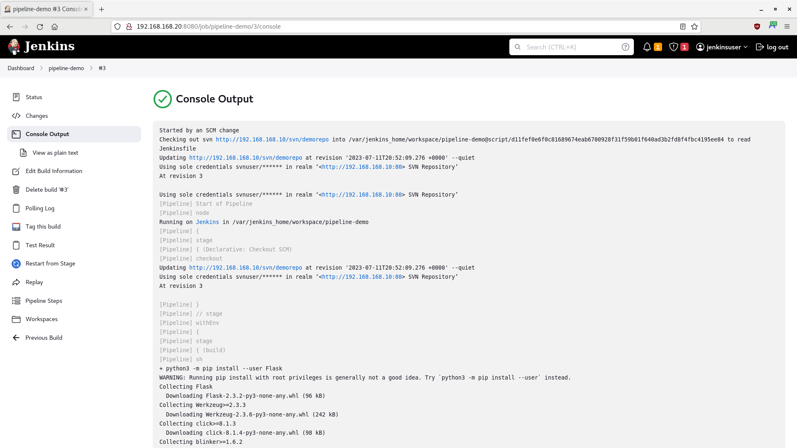

# Pipeline Testing Stage Demo

In this tutorial, you will use a Jenkins pipeline to test code and verify a file's integrity.

- [Getting Started](#getting-started)
- [Checkout the Repository](#checkout-the-repository)
- [Create the Website](#create-the-website)
- [See the Results in Jenkins](#see-the-results-in-jenkins)
- [Summary](#summary)

> **WARNING** -  This is only a proof-of-concept demo for a single user! Do not use for production.

-----

## Getting Started

1. Ensure you have completed the steps in the [Jenkins Container Demo](/03-jenkins-container/03-jenkins-container.md).

2. Ensure that the following containers are running:

    - Subversion: `sudo podman start svn_node`
    - Jenkins: `sudo podman start jenkins_node`

3. Ensure that the **svn-root** volume exists: `sudo podman volume inspect svn-root`

-----

## Checkout the Repository

> **NOTE** - Ensure you have installed the following applications and packages on the development host:
>
> - Subversion: `sudo yum -y install subversion`
> - Flask: `python3 -m pip install --user Flask`
> - xmlrunner: `python3 -m pip install --user xmlrunner`

1. Open a Terminal, if one is not already open.

2. Checkout the repository:

    ```bash
    svn checkout http://192.168.168.10/svn/demorepo/
    ```

3. If prompted for your sudo credentials, enter your password:

    ```bash
    Authentication realm: <http://192.168.168.10:80> SVN Repository
    Password for '<your username>': *************
    ```

4. When prompted for the repository credentials, enter `svnuser` for the username and `Change.Me.123` for the password:

    ```bash
    Authentication realm: <http://192.168.168.10:80> SVN Repository
    Username: svnuser
    Password for 'svnuser': *************
    ```

5. Navigate to the repository directory:

    ```bash
    cd demorepo
    ```

6. Ensure your local repository is up-to-date with the remote repository. When prompted for the repository password, enter `Change.Me.123`:

    ```bash
    svn update
    ```

-----

## Create the Website

1. Create a dummy comma-separated values (CSV) data file:

    ```bash
    touch data.csv
    ```

2. Using an editor of your choice, open `data.csv` and add the following data:

    ```text
    1,Delaware,1787
    2,Pennsylvania,1787
    3,New Jersey,1787
    4,Georgia,1788
    5,Connecticut,1788
    6,Massachusetts,1788
    7,Maryland,1788
    8,South Carolina,1788
    9,New Hampshire,1788
    10,Virginia,1788
    11,New York,1788
    12,North Carolina,1789
    13,Rhode Island,1790
    ```

3. Get the SHA-256 hash of `data.csv`:

    ```bash
    sha256sum data.csv
    ```

    **Output:**

    ```bash
    c510534c3a1c3a6f015bcfdd0da8b29eb1fecde01d4ce43435a59d14d25e3980  data.csv
    ```

    > **NOTE** - Depending on your default encoding; or if you added a carriage return to the end of the file, your result may be different (e.g, `bc1932ebf66ff108fb5ff0a6769f2023a9002c7dafee53d85f14c63cab428b4a`, `b055021f394e6e841bf004a3e1a3f65d1521b861f275c9e5b06ace04dd1e6a8e`, etc.). Use the hash produced on your development machine.

4. Create a simple Flask application to read the data:

   ```bash
   touch app.py
   ```

5. Using an editor of your choice, open `app.py` and add the following code:

   ```python
   from flask import Flask, render_template
   import csv

   app = Flask(__name__)


   @app.route('/')
   def say_hello():
       return '<h1>Hello, World!</h1>'


   @app.route('/data')
   def show_data():
       with open("data.csv") as file:
           reader = csv.reader(file)
           return render_template("data.html", csv=reader)


   if __name__ == '__main__':
       app.run()
   ```

6. Create an HTML page to display the data:

   ```bash
   mkdir -p templates
   touch templates/data.html
   ```

7. Using an editor of your choice, open `data.html` and add the following code:

   ```html
   <table id="first_states">
       <caption>First 13 States</caption>
       <tr>
           <th>#</th>
           <th>State</th>
           <th>Year</th>
       </tr>
       
       <tr>
           
           <td>{{ col }}</td>
           
       </tr>
       
   </table>
   ```

8. Start the application:

   ```bash
   flask --app app run
   ```

   **Output:**

   ```bash
    * Serving Flask app 'app'
    * Debug mode: off
   WARNING: This is a development server. Do not use it in a production deployment. Use a production WSGI server instead.
    * Running on http://127.0.0.1:5000
   Press CTRL+C to quit
   ```

9. Open a browser and navigate to the IPv4 address in the output (you may have to open a new Terminal):

   ```bash
   firefox http://127.0.0.1:5000
   ```

   

10. Append "`/data`" to the end of the URL and the list of states should appear:

    

11. Stop the application in the original Terminal by pressing **[CTRL]** + **[C]**. Close the browser as well.

12. Create a unit test for your Flask application:

    ```bash
    touch test_app.py
    ```

13. Using an editor of your choice, open `test_app.py` and add the following code:

    > **NOTE** - Adapted from <http://pkuwwt.github.io/programming/2020-03-16-jenkins-continuous-integration-testing-for-flask/>

    ```python
    import unittest
    import xmlrunner
    from app import app


    class TestSayHello(unittest.TestCase):
        def setUp(self):
            app.testing = True
            self.app = app.test_client()

        def test_say_hello(self):
            rv = self.app.get('/')
            self.assertEqual(rv.status, '200 OK')
            self.assertEqual(rv.data, b'<h1>Hello, World!</h1>')


    if __name__ == '__main__':
        runner = xmlrunner.XMLTestRunner(output='test-reports')
        unittest.main(testRunner=runner)
    ```

14. Run the test:

    ```bash
    python3 test_app.py
    ```

    **Output:**

    ```bash
    Running tests...
    ----------------------------------------------------------------------
    .
    ----------------------------------------------------------------------
    Ran 1 test in 0.002s

    OK

    Generating XML reports...
    ```

    > **NOTE** - The test will create a sub-directory named "test-reports", containing your test results in a time-stamped `.xml` file, prefixed with the word `TEST`:
    >
    > ```xml
    > <?xml version="1.0" ?>
    > <testsuite name="TestSayHello-20230822095013" tests="1" time="0.003" failures="0" errors="0">
    >    <testcase classname="TestSayHello" name="test_say_hello" time="0.003"/>
    >    <system-out><![CDATA[]]></system-out>
    >    <system-err><![CDATA[]]></system-err>
    > </testsuite>
    >```

15. Using an editor of your choice, open the Jenkinsfile and modify it to match the following code. Remember to replace the hash below with the hash produced by the `sha256sum` command:

    ```groovy
    pipeline {
        agent {
            any {
                image 'python:3'
            }
        }
        stages {
            stage('build') {
                steps {
                    echo "Building ${env.JOB_NAME}..."
                    sh 'python3 -m pip install --user Flask'
                    sh 'python3 -m pip install --user xmlrunner'
                    sh 'cat /etc/os-release'
                }
            }
            stage('test') {
                steps {
                    echo "Testing ${env.JOB_NAME}..."
                    // Ensure the data.csv file is not corrupted
                    sh 'echo "c510534c3a1c3a6f015bcfdd0da8b29eb1fecde01d4ce43435a59d14d25e3980  data.csv" | sha256sum -c'
                    // Unit test app.py
                    sh 'python3 test_app.py'
                }
                post {
                    always {
                        junit 'test-reports/*.xml'
                    }
                }
            }
        }
        post {
            success {
                echo "Good to go!"
            }
            failure {
                echo "Houston, we've had a problem."
            }
        }
    }
    ```

16. Add all the changes to your local repository:

    ```bash
    svn add . --force
    ```

17. Push your changes to the remote repository. When prompted for the repository password, enter `Change.Me.123`:

    ```bash
    svn commit -m "Added simple Flask app with unit test."
    ```

-----

## See the Results in Jenkins

1. If it is not already open, access Jenkins in the browser and open the **pipline-demo** project:

    

2. Wait two minutes for Jenkins to contact the SVN server, then refresh the page. Another build should appear under **Build History**, along with the **Stage View**:

    > **NOTE** - If refresh does not work, click on **Build Now**.

    

3. Click on the build (**#2**) under **Build History**. The build page should appear:

   

    >**NOTE** - A new button, in the shape of a clipboard, will now appear, containing your test results.

4. On the **Build** page, click on the **Console Output** link. Look through the output, and you will see comments for each stage, as well as the success message of "Good to go!":

   

5. Click on the **pipeline-demo** link at the top of the page to return to the project page.

-----

## Summary

In this tutorial, you used a Jenkins pipeline to test code and verify a file's integrity. Please continue to our [SonarQube Analysis Stage Demo](/05-sonarqube-container/05-sonarqube-container.md). Remember, this is only a proof-of-concept demo for a single user; you should not use it for production.
