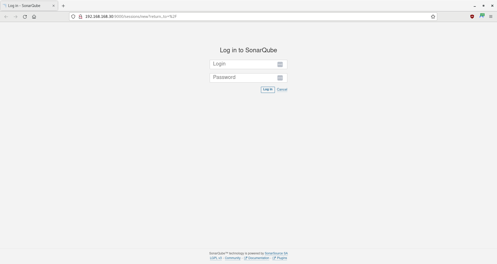
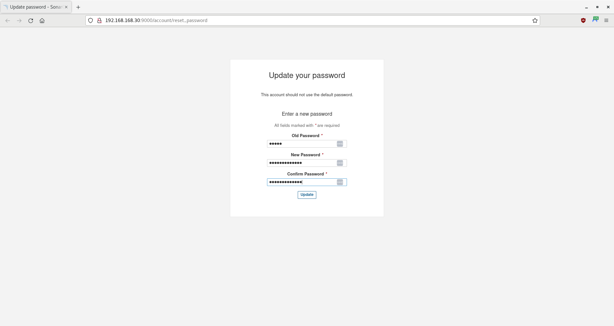
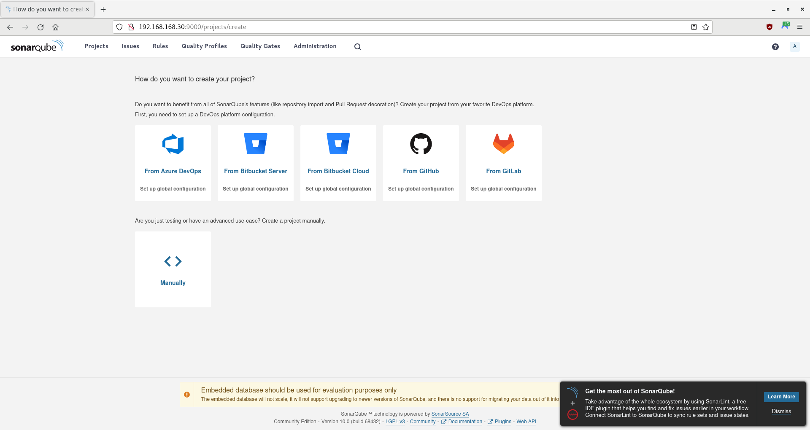

# SonarQube Container Demo

In this tutorial, you will run a SonarQube server in a container and itegrate it with Jenkins to check code quality.

- [Getting Started](#getting-started)
- [Create and Add the SonarQube Server Container to the Network](#create-and-add-the-sonarqube-server-container-to-the-network)
- [Access and Setup SonarQube](#access-and-setup-sonarqube)
- [Summary](#summary)

> **WARNING** -  This is only a proof-of-concept demo for a single user! Do not use for production.

-----

## Getting Started

Ensure you have completed the steps in the [Pipeline Testing Stage Demo](/04-testing-stage/04-testing-stage.md).

-----

## Create and Add the SonarQube Server Container to the Network

For this tutorial, you will use the freely available AlmaLinux 8 image as the operating system for your containers. However, you may use other comparable images, such as CentOS, Rocky Linux, or a Red Hat's Universal Base Image (UBI) (subscription required).

1. Open a Terminal, if one is not already open.

2. SonarQube uses the Elastisearch search engine, and Elasticsearch uses a `mmapfs` directory to store its indices. On most systems, the default mmap count limit is 65530, which is too low for Elastisearch, resulting in out-of-memory exceptions. In order for SonarQube to work, [you must set the `vm.max_map_count` on the container's host to a minimum value of 262144.](https://www.elastic.co/guide/en/elasticsearch/reference/current/vm-max-map-count.html):

    ```bash
    sudo dnf -y install procps-ng
    sudo sysctl -w vm.max_map_count=262144
    ```

    > **NOTE** - You could run this command in the container itself, but it would retrun to the default value each time the container was restarted.

3. Create a service file:

    ```bash
    touch sonarqube.service
    ```

4. Using an editor of your choice, open `sonarqube.service` and add the following code:

    ```ini
    [Unit]
    Description=SonarQube service
    After=syslog.target network.target

    [Service]
    Type=simple
    User=sonarqube
    Group=sonarqube
    PermissionsStartOnly=true
    ExecStart=/bin/nohup /usr/bin/java -Xms32m -Xmx32m -Djava.net.preferIPv4Stack=true -jar /opt/sonarqube/lib/sonar-application-10.0.0.68432.jar
    StandardOutput=syslog
    LimitNOFILE=65536
    LimitNPROC=8192
    TimeoutStartSec=5
    Restart=always
    SuccessExitStatus=143

    [Install]
    WantedBy=multi-user.target
    ```

5. Create a containerfile:

    ```bash
    touch sonarqube.containerfile
    ```

6. Using an editor of your choice, open `sonarqube.containerfile` and add the following code:

    ```dockerfile
    # Pull a Docker or Podman image. For this demo, you will use AlmaLinux 8
    FROM almalinux:8
    USER root

    # Ensure the system is up-to-date
    RUN yum -y update &&\
        yum -y upgrade &&\
        yum -y clean all &&\
        yum -y autoremove

    # Ensure the passwd utility is installed
    RUN yum -y install passwd

    # Create a non-root user and create a root password
    # useradd  --comment "Default User Account" --create-home -groups wheel user
    RUN useradd -c "Default User Account" -m -G wheel user &&\
        echo Change.Me.123 | passwd user --stdin &&\
        echo Change.Me.321 | passwd root --stdin

    # Adapted from https://access.redhat.com/solutions/7015042
    # Install openssh, httpd, and sudo
    RUN yum -y install openssh openssh-askpass openssh-clients openssh-server &&\
        yum -y install httpd &&\
        yum -y install sudo

    # Enable the HTTP and SSH daemons
    RUN systemctl enable httpd &&\
        systemctl enable sshd

    # Customize the SSH daemon
    RUN mkdir --parents /var/run/sshd &&\
        ssh-keygen -A &&\
        cp /etc/ssh/sshd_config /etc/ssh/sshd_config.bak &&\
        sed -i 's/PermitRootLogin prohibit-password/PermitRootLogin yes/' /etc/ssh/sshd_config &&\
        cp /etc/pam.d/sshd /etc/pam.d/sshd.bak &&\
        sed -i 's@session\s*required\s*pam_loginuid.so@#session optional pam_loginuid.so@g' /etc/pam.d/sshd

    # Prevent 'System is booting up. Unprivileged users are not permitted to log in yet' error when not root
    # Do not exit on error if the directory does not exist: rm /run/nologin || true
    RUN rm /run/nologin || :

    # Pass environment variables 
    # https://stackoverflow.com/questions/36292317/why-set-visible-now-in-etc-profile
    ENV NOTVISIBLE "in users profile"
    RUN echo "export VISIBLE=now" >> /etc/profile

    # Install Java
    RUN yum -y install java-17-openjdk-devel

    # Ensure wget and unzip are installed
    RUN yum -y install wget && yum -y install unzip

    # Download and extract SonarQube
    RUN mkdir --parents /opt
    RUN wget https://binaries.sonarsource.com/Distribution/sonarqube/sonarqube-10.0.0.68432.zip
    RUN unzip sonarqube-10.0.0.68432.zip -d /opt
    RUN mv /opt/sonarqube-10.0.0.68432 /opt/sonarqube
    RUN rm -f sonarqube-10.0.0.68432.zip

    RUN wget https://binaries.sonarsource.com/Distribution/sonar-scanner-cli/sonar-scanner-cli-5.0.1.3006-linux.zip
    RUN unzip sonar-scanner-cli-5.0.1.3006-linux.zip -d /opt
    # FYI: Unzip changes the name (removing the -cli part)
    RUN mv /opt/sonar-scanner-5.0.1.3006-linux /opt/sonar-scanner
    RUN rm -f sonar-scanner-cli-5.0.1.3006-linux.zip

    # Create a SonarQube user
    # id -u sonarqube &>/dev/null || useradd --home-dir /opt/sonarqube/ --groups wheel --system sonarqube
    RUN useradd -c "SonarQube Account" -d /opt/sonarqube/ -G wheel -r sonarqube &&\
        echo Change.Me.123 | passwd sonarqube --stdin &&\
        chown -R sonarqube:sonarqube /opt/sonarqube &&\
        chmod 775 -R /opt/sonarqube

    RUN chown -R sonarqube:sonarqube /opt/sonar-scanner &&\
        chmod 775 -R /opt/sonar-scanner

    # Create the SonarQube service
    ADD sonarqube.service /etc/systemd/system/sonarqube.service

    # Start SonarQube
    RUN systemctl enable sonarqube
    RUN runuser --login sonarqube --command "/opt/sonarqube/bin/linux-x86-64/sonar.sh start"

    # Allow traffic through ports 22 (SSH) and 9000 (SonarQube)
    EXPOSE 22 9000

    # Ensure the system is still up-to-date
    RUN yum -y update

    # Start the systemd service
    # https://access.redhat.com/documentation/en-us/red_hat_enterprise_linux_atomic_host/7/html/managing_containers/running_containers_as_systemd_services_with_podman#starting_services_within_a_container_using_systemd
    CMD [ "/sbin/init" ]
    ```

7. Build the image:

    > **NOTE** - Podman uses `/var/tmp` by default to download and build images. If a `No space left on device` error appears during the build, you can change the `image_copy_tmp_dir` setting in the `containers.conf` file, usually located in `/usr/share/containers/containers.conf`.

    ```bash
    # Optional; remove final and intermediate images if they exist
    sudo podman rmi sonarqube_node_image --force
    sudo podman image prune --all --force
    # Build the image
    sudo podman build --rm --tag=sonarqube_node_image --file=sonarqube.containerfile
    ```

8. Once complete, look at your image's information:

    ```bash
    sudo podman images
    ```

    **Output (other images may also appear):**

    ```bash
    REPOSITORY                      TAG         IMAGE ID      CREATED             SIZE
    localhost/sonarqube_node_image  latest      931be7a02def  46 seconds ago  2.78 GB
    docker.io/library/almalinux     8           4e97feadb276  6 weeks ago         204 MB
    ...
    ```

    > **NOTE** - Any repositories named `<none>` that appear are intermediate images, used to build the final image. However, the `--rm` option should have told Podman to delete them after a successful build.

9. Using the new image, create a SonarQube node and attach it to the network:

    ```bash
    # Optional; stop and remove the nodes if they exist
    sudo podman stop sonarqube_node
    sudo podman rm sonarqube_node
    # Create the nodes and attach them to the network
    sudo podman run -dt --name sonarqube_node --replace --restart=unless-stopped --net devnet --ip 192.168.168.30 --cap-add AUDIT_WRITE sonarqube_node_image
    ```

10. Look at the containers:

    ```bash
    sudo podman ps --all
    ```

    **Output (other nodes may also appear):**

    ```bash
    CONTAINER ID  IMAGE                                  COMMAND     CREATED         STATUS         PORTS  NAMES
    048eb28a2192  localhost/sonarqube_node_image:latest  /sbin/init  15 seconds ago  Up 15 seconds         sonarqube_node
    ...
    ```

11. Check the IPv4 addresses of the node; it should be `192.168.168.30`:

    ```bash
    sudo podman inspect sonarqube_node -f '{{ .NetworkSettings.Networks.devnet.IPAddress }}'
    ``````

-----

## Access and Setup SonarQube

1. Open a Terminal, if one is not already open.

2. Open a browser and navigate to the IPv4 address of the SonarQube server:

    ```bash
    firefox 192.168.168.30:9000
    ```

3. A web page should appear, asking you to log in:

    

4. Enter **admin** for both the username and the password. A new page will appear, asking you to change your password. Change it to **Change.Me.123** for now:

    

5. A page will appear, asking you how do you want to create your project:

    

    > **NOTE** - A warning appears at the bottom of the page, stating that, *"The embedded database should be used for evaluation purposes only."* By default, SonarQube uses a built-in H2 database. You can change the database to [a supported database, such as PostgreSQL, MS SQL Server, and Oracle/MySQL](https://docs.sonarsource.com/sonarqube/9.9/setup-and-upgrade/install-the-server/) if you like, but that is beyond the scope of this tutorial. Please note that the Community Edition does not support running SonarQube in a clustered configuration.

6. Unfortunately, Subversion is not a supported DevOps platform.

-----

## Summary

In this tutorial, you ran a Sonarqube... Remember, this is only a proof-of-concept demo for a single user; you should not use it for production.
