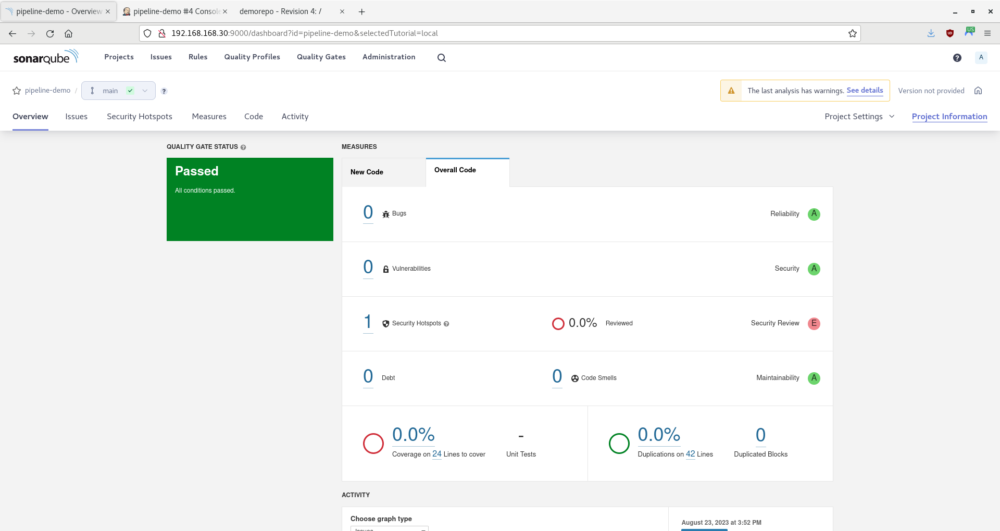
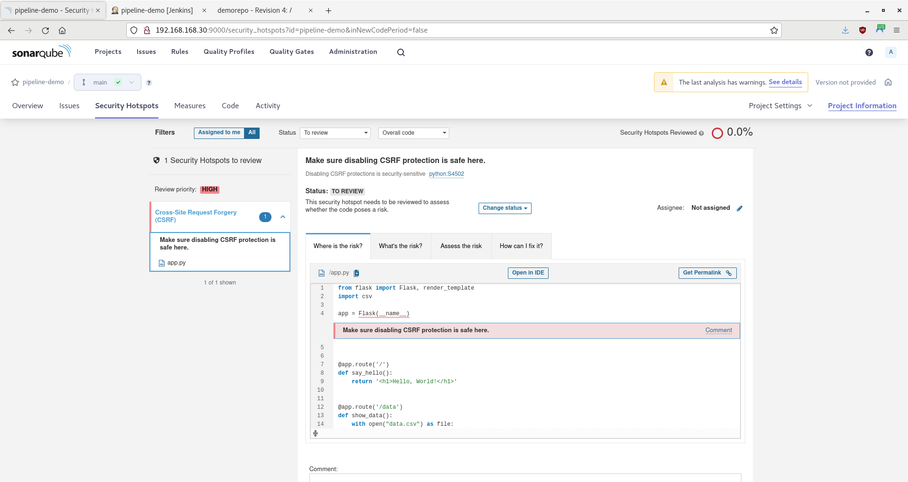
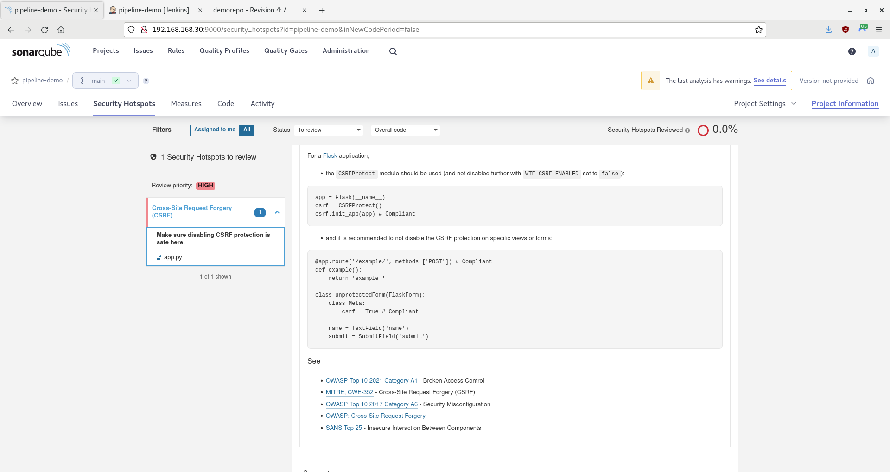

# Quality Gates Demo

In this tutorial, you will ...

- [Getting Started](#getting-started)
- [Adding a Quality Gate](#adding-a-quality-gate)
- [Summary](#summary)

> **WARNING** -  This is only a proof-of-concept demo for a single user! Do not use for production.

-----

## Getting Started

1. Ensure you have completed the steps in the [SonarQube Container Demo](/05-sonarqube-container/05-sonarqube-container.md).

2. Ensure that the following containers are running:

    - Subversion: `sudo podman start svn_node`
    - Jenkins: `sudo podman start jenkins_node`
    - SonarQube: `sudo podman start sonarqube_node`

3. Ensure that the **svn-root** volume exists: `sudo podman volume inspect svn-root`

4. Ensure you are not in the `demorepo` directory (your local repository) yet; otherwise, you may push files to the repository that should not be there, such as containerfiles.

-----

## Introduction

1. When you looked at the results of SonarQube's analysis in the [SonarQube Analysis Stage Demo](/05-sonarqube-container/05-sonarqube-container.md), you may have noticed that you got all A's, except in Security Hotspots:

    

2. **Security Hotspots** are security-sensitive code that requires manual review to assess whether a vulnerability exists. Click on the number **1**; the Security Hotspots page will appear:

   

3. Looks like there is a Cross-Site Request Forgery (CSRF) issue in the code. SonarQube not only shows you where is the risk, but it also explains:

   - What is the risk
   - How to assess the risk
   - How to fix the risk

   Click on each tab and read what SonarQube has to say; if you like, you can click the provided external links to learn even more. When you get to the ***How can I fix it?*** tab, scroll down to the complaint solution for Flask:

   

4. Open a Terminal, if one is not already open.
5. SonarQube told you that the CSRFProtect module should be used to fix the vulnerability. However, the CSRFProtect module is in the [Flask-WTF package](https://wtforms.readthedocs.io), which, unlike the Flask framework, does not come with Python by default. To install the Flask-WTF package, run the following command:

   ```bash
   python3 -m pip install Flask-WTF
   ```

TODO: Create a requirements.txt file
Add Flask, xmlrunner, and Flask-WTF to the file
Modify the Jenkinsfile

```groovy
stage('build') {
   steps {
       echo "Building ${env.JOB_NAME}..."
       sh 'python3 -m pip install -r requirements.txt'
       sh 'cat /etc/os-release'
   }
}
```

6. Using an editor of your choice, open `app.py` in your local `demorepo` repository. Modify the code to match the following:

   ```python
   import csv
   
   from flask import Flask, render_template
   from flask_wtf import CSRFProtect
   
   app = Flask(__name__)
   csrf = CSRFProtect()
   csrf.init_app(app)  # Compliant
   
   
   @app.route('/', methods=['POST'])  # Compliant
   def say_hello():
       return '<h1>Hello, World!</h1>'
   
   
   @app.route('/data', methods=['POST'])  # Compliant
   def show_data():
       with open("data.csv") as file:
           reader = csv.reader(file)
           return render_template("data.html", csv=reader)
   
   
   if __name__ == '__main__':
       app.run()
   ```

7. Push your changes to the remote repository. If prompted for the repository password, enter ***"Change.Me.123"***:

    ```bash
    svn add app.py --force
    svn commit -m "Removed CSRF vulnerability." --non-interactive --username 'svnuser' --password 'Change.Me.123'
    ```

8. Go back to Jenkins, wait two minutes for Jenkins to contact the SVN server, then refresh the page. Another build should appear under **Build History**, along with the **Stage View**.

    > **NOTE** - If refresh does not work, click on **Build Now**.

-----

## Adding a Quality Gate

-----

## Summary

In this tutorial, you ... Remember, this is only a proof-of-concept demo for a single user; you should not use it for production.
